Got it 👍 Let’s go step by step through **Bead Sort (Gravity Sort, Abacus Sort)** in the exact structure you asked for.

---

# 1. One-line summary

**Bead sort** is a sorting algorithm that simulates gravity: numbers are represented as rows of beads that "fall down," naturally arranging themselves in ascending order. It works only for **positive integers**.

---

# 2. Intuition and real-world analogy

Think of beads on vertical rods of an abacus. If you tilt the abacus, the beads slide downward due to gravity. The final position has beads stacked neatly at the bottom, and when you read row by row, the numbers appear sorted.

---

# 3. Formal definition and key properties

* **Input**: a list of non-negative integers.
* **Output**: the same integers sorted in ascending order.
* **Core property**: Sorting happens by simulating a physical system where beads fall into the lowest available positions.
* **Constraints**: Only works with non-negative integers (not negative numbers or floats).

---

# 4. Required operations

Unlike typical data structures, Bead sort doesn’t have `insert`, `delete`, or `search`. The *only operation* is:

* **Drop beads (gravity)** → rearrange beads so they slide down.

---

# 5. Step-by-step algorithm walkthrough

Suppose we want to sort:
`[5, 3, 1, 7]`

### Step 1: Represent numbers as beads

* Each number = row of beads.
* Example: `5` means 5 beads.

| Row | Beads         |
| --- | ------------- |
| 5   | ● ● ● ● ●     |
| 3   | ● ● ●         |
| 1   | ●             |
| 7   | ● ● ● ● ● ● ● |

---

### Step 2: Place beads on rods (columns)

Think of each bead as occupying a "column".

```
Row 5: ● ● ● ● ●
Row 3: ● ● ●
Row 1: ●
Row 7: ● ● ● ● ● ● ●
```

---

### Step 3: Let gravity pull beads down

* In each column, beads "fall" to the bottom.
* Example: Column 1 has 4 beads (from rows 5, 3, 1, 7) → they fall to bottom 4 rows.

---

### Step 4: Read new row lengths

After beads settle, count beads in each row (from top row down).

Result: `[1, 3, 5, 7]` (sorted ascending).

---

# 6. Pseudocode

```
function bead_sort(array):
    n = length(array)
    max_val = max(array)
    grid = matrix of 0s with n rows and max_val columns
    
    # Place beads
    for i from 0 to n-1:
        for j from 0 to array[i]-1:
            grid[i][j] = 1
    
    # Gravity step
    for j from 0 to max_val-1:
        count = 0
        for i from 0 to n-1:
            count += grid[i][j]
            grid[i][j] = 0
        for i from n-count to n-1:
            grid[i][j] = 1
    
    # Read result
    for i from 0 to n-1:
        array[i] = sum(grid[i])
    return array
```

---

# 7. Two runnable Python implementations

### Short idiomatic version

```python
def bead_sort(arr):
    if not arr: 
        return []
    max_val = max(arr)
    grid = [[1] * x + [0] * (max_val - x) for x in arr]
    for j in range(max_val):
        count = sum(grid[i][j] for i in range(len(arr)))
        for i in range(len(arr)):
            grid[i][j] = 1 if i >= len(arr) - count else 0
    return [sum(row) for row in grid]
```

### Commented learner-friendly version

```python
def bead_sort_learn(arr):
    if not arr:
        return []
    
    # Step 1: Build grid
    max_val = max(arr)
    grid = []
    for num in arr:
        row = [1] * num + [0] * (max_val - num)
        grid.append(row)
    
    # Step 2: Gravity simulation
    for col in range(max_val):
        beads = 0
        for row in range(len(arr)):
            beads += grid[row][col]
            grid[row][col] = 0  # clear column
        for row in range(len(arr) - beads, len(arr)):
            grid[row][col] = 1  # beads fall
    
    # Step 3: Convert back to numbers
    sorted_arr = []
    for row in grid:
        sorted_arr.append(sum(row))
    return sorted_arr
```

---

# 8. Worked examples

### Example: `[5, 3, 1, 7]`

**Initial grid (rows = numbers, cols = beads):**

| Row | Representation |
| --- | -------------- |
| 5   | ● ● ● ● ● 0 0  |
| 3   | ● ● ● 0 0 0 0  |
| 1   | ● 0 0 0 0 0 0  |
| 7   | ● ● ● ● ● ● ●  |

---

**After gravity (beads fall):**

| Row | New Representation |
| --- | ------------------ |
| 1   | ● 0 0 0 0 0 0      |
| 3   | ● ● ● 0 0 0 0      |
| 5   | ● ● ● ● ● 0 0      |
| 7   | ● ● ● ● ● ● ●      |

Sorted result: `[1, 3, 5, 7]`

---

### Mermaid diagram (gravity effect)

```mermaid
graph TD
    A[5 ●●●●●] -->|falls| D[7 ●●●●●●●]
    B[3 ●●●] -->|falls| C[5 ●●●●●]
    C -->|falls| B[3 ●●●]
    D -->|falls| A[1 ●]
```



ASCII fallback:

```
Before gravity:        After gravity:
[5] ●●●●●              [1] ●
[3] ●●●                [3] ●●●
[1] ●                  [5] ●●●●●
[7] ●●●●●●●            [7] ●●●●●●●
```

---

# 9. Complexity

* **Time**:

  * Best, average, worst: `O(n * max_value)` (since we simulate each bead/column).
* **Space**: `O(n * max_value)` (the bead grid).
* Not efficient for large numbers but simple for small integers.

---

# 10. Correctness sketch / invariant

Invariant: After gravity settles, each column has all beads stacked at the bottom. Thus, row lengths (count of beads) are in non-decreasing order from top to bottom. Reading these lengths gives a sorted array.

---

# 11. Pitfalls, edge cases, variations

* **Does not work** for negative numbers or floats.
* **Space heavy** if max number is large.
* Works well only for small integers.
* Optimizations: simulate bead counts without explicit grid (reduces memory).

---

# 12. Practice problems

1. **Easy**: Sort `[2, 1, 4, 3]` using bead sort.
   *Solution*: Final sorted = `[1, 2, 3, 4]`.

2. **Medium**: Modify bead sort to return descending order instead of ascending.
   *Solution*: After beads settle, reverse the array when reading row sums.

---

# 13. Cheat-sheet

* Bead sort = gravity + abacus beads.
* Only works for **non-negative integers**.
* Build grid → drop beads → count rows.
* Time & space: `O(n * max_value)`.
* Rarely practical, but great for learning sorting intuition.

👉 Next topics: Counting sort, Radix sort, Bucket sort (other integer-based algorithms).

---

Would you like me to also show you a **memory-optimized version** of bead sort (no full grid, just counts) so you can see how professionals refine such algorithms?
