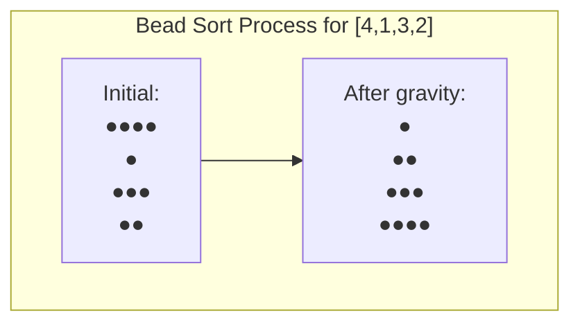

# Bead Sort (Gravity Sort / Abacus Sort)

## 1. One-line summary
Bead sort is a natural sorting algorithm that works by simulating gravity pulling beads down vertical rods, useful only for sorting positive integers.

## 2. Intuition and real-world analogy
Imagine you have vertical rods with beads representing numbers - when you lift the rods and let gravity pull the beads down, they naturally settle into sorted order from largest to smallest. It's like dropping different amounts of sand into vertical tubes and watching them settle!

## 3. Formal definition and key properties
Bead sort is a non-comparative sorting algorithm that represents positive integers as beads on vertical rods. The algorithm simulates gravity by allowing beads to "fall" to the lowest possible position, resulting in a sorted array. It's a **stable**, **natural**, and **distributive** sorting algorithm that only works with **positive integers**.

## 4. Required operations
- **Initialization**: Create a grid representation of beads based on input numbers
- **Gravity simulation**: Allow beads to fall to their lowest possible positions  
- **Reading result**: Extract sorted numbers by counting beads in each column

## 5. Step-by-step algorithm walkthrough

### Steps:
1. **Create bead grid**: Represent input numbers as beads in a 2D grid
2. **Apply gravity**: Let beads fall to the bottom of each column
3. **Read result**: Count beads in each row to get sorted numbers

### Concrete example with [3, 1, 2]:

**Step 1: Create bead grid**
```
Input: [3, 1, 2]
Create grid where row i has input[i] beads:
Row 0: ● ● ● (3 beads)
Row 1: ●     (1 bead)  
Row 2: ● ●   (2 beads)
```

**Step 2: Apply gravity**
```
Before gravity:
Column 0: [1, 1, 1] (beads in rows 0,1,2)
Column 1: [1, 0, 1] (beads in rows 0,2)  
Column 2: [1, 0, 0] (bead in row 0)

After gravity (beads fall to bottom):
Column 0: [0, 0, 1] 
Column 1: [0, 1, 1]
Column 2: [1, 1, 1]
```

**Step 3: Read result**
```
Count beads in each row:
Row 0: 1 bead → 1
Row 1: 2 beads → 2  
Row 2: 3 beads → 3
Result: [1, 2, 3]
```

## 6. Pseudocode

```
function beadSort(array):
    max = findMaximum(array)
    n = length(array)
    
    // Create bead grid
    beads = create 2D array of size n × max filled with 0s
    
    // Place beads
    for i = 0 to n-1:
        for j = 0 to array[i]-1:
            beads[i][j] = 1
    
    // Apply gravity
    for j = 0 to max-1:
        sum = 0
        // Count beads in column j
        for i = 0 to n-1:
            sum += beads[i][j]
        
        // Clear column
        for i = 0 to n-1:
            beads[i][j] = 0
            
        // Drop beads to bottom
        for i = n-sum to n-1:
            beads[i][j] = 1
    
    // Read sorted array
    for i = 0 to n-1:
        array[i] = 0
        for j = 0 to max-1:
            array[i] += beads[i][j]
    
    return array
```

## 7. Two runnable implementations

### Short, idiomatic version:

```python
def bead_sort(arr):
    if not arr:
        return arr
    
    max_val = max(arr)
    n = len(arr)
    
    # Create bead grid
    beads = [[0] * max_val for _ in range(n)]
    
    # Place beads
    for i, num in enumerate(arr):
        for j in range(num):
            beads[i][j] = 1
    
    # Apply gravity
    for j in range(max_val):
        # Count beads in this column
        sum_beads = sum(beads[i][j] for i in range(n))
        
        # Drop beads to bottom
        for i in range(n):
            beads[i][j] = 1 if i >= n - sum_beads else 0
    
    # Read result
    return [sum(row) for row in beads]
```

### Commented version for learners:

```python
def bead_sort_detailed(arr):
    """
    Sort positive integers using bead sort algorithm.
    
    Args:
        arr: List of positive integers to sort
        
    Returns:
        List of sorted integers (ascending order)
    """
    # Handle empty array
    if not arr:
        return arr
    
    # Find maximum value to determine grid width
    max_val = max(arr)
    n = len(arr)
    
    # Create 2D grid to represent beads
    # Each row represents a number, each column a position
    beads = [[0] * max_val for _ in range(n)]
    
    # Place beads: for each number, put that many beads in its row
    for i, num in enumerate(arr):
        for j in range(num):
            beads[i][j] = 1  # Place a bead
    
    # Apply gravity: beads fall to bottom of each column
    for j in range(max_val):  # For each column
        # Count how many beads are in this column
        sum_beads = 0
        for i in range(n):
            sum_beads += beads[i][j]
        
        # Clear the column
        for i in range(n):
            beads[i][j] = 0
        
        # Drop all beads to the bottom of the column
        for i in range(n - sum_beads, n):
            beads[i][j] = 1
    
    # Read the sorted numbers by counting beads in each row
    result = []
    for i in range(n):
        row_sum = 0
        for j in range(max_val):
            row_sum += beads[i][j]
        result.append(row_sum)
    
    return result
```

## 8. Complete worked examples

### Example: [4, 1, 3, 2]

#### Textual table of states:

| Step | Description | Grid State | Result |
|------|-------------|------------|---------|
| 1 | Initial placement | Row 0: ●●●●<br>Row 1: ●<br>Row 2: ●●●<br>Row 3: ●● | [4,1,3,2] |
| 2 | After gravity col 0 | Col 0: [0,0,0,1] | - |
| 3 | After gravity col 1 | Col 0,1: [0,0,1,1] | - |
| 4 | After gravity col 2 | Col 0-2: [0,1,1,1] | - |
| 5 | After gravity col 3 | Col 0-3: [1,1,1,1] | - |
| 6 | Final count | Final grid shown below | [1,2,3,4] |

#### Final grid visualization:



ASCII fallback:
```
Initial state:        After gravity:
●●●●                  ●
●                     ●●
●●●                   ●●●
●●                    ●●●●
```

## 9. Complexity

- **Time complexity**: O(n × max) where n is array length and max is maximum value
- **Space complexity**: O(n × max) for the bead grid

**Explanation**: 
- Time: We iterate through each of the max columns and for each, we scan all n rows twice (once to count, once to drop beads)
- Space: We need a 2D grid of size n × max to represent all possible bead positions

## 10. Correctness sketch or invariant

The key invariant is that after processing each column, all beads in that column have "fallen" to the lowest possible positions. This maintains the property that when we read the final result row by row, we get the count of beads at each level, which corresponds to the sorted order. Since beads can only fall down (never up), and we process columns independently, the final configuration represents a stable sorted state.

## 11. Common pitfalls, edge cases, and variations/optimizations

**Common pitfalls:**
- Only works with positive integers (no negative numbers or floats)
- Space inefficient for large maximum values
- Not suitable for general-purpose sorting

**Edge cases:**
- Empty array: returns empty array
- Single element: returns same element
- All elements equal: returns same array
- Already sorted array: still works correctly

**Variations/optimizations:**
- **Space optimization**: Use bit manipulation instead of 2D array
- **In-place version**: Modify the original array instead of creating new structures
- **Counting approach**: Instead of simulating gravity, directly count bead positions

## 12. Practice problems

**Easy**: Sort [5, 2, 8, 1] using bead sort.
**Solution**: [1, 2, 5, 8]

**Medium**: Given an array of bead counts [3, 0, 7, 2, 1], implement bead sort and trace the grid state after processing the first 2 columns.
**Solution**: After column 0: [0,0,0,1,1], After column 1: [0,0,1,1,1]

## 13. Cheat-sheet and next topics

**Cheat-sheet:**
• Only works with positive integers
• Time: O(n × max), Space: O(n × max)
• Simulates gravity on beads in vertical columns
• Stable and natural sorting algorithm
• Not practical for real applications due to space requirements

**Recommended next topics:**
• Counting sort (more practical for integers)
• Radix sort (efficient for bounded integers)
• Bucket sort (generalization for floating point)
• Comparison-based sorting algorithms (quicksort, mergesort)