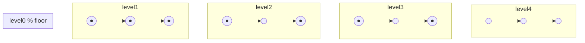

1. One-line summary  
Bead sort turns every number into that many “beads on a wire” and lets gravity pull them down; after the dust settles the columns are the numbers in sorted order – only works for non-negative integers and is mainly a teaching toy.

2. Intuition and real-world analogy  
Picture an old abacus: you slide the same number of beads to the top on every wire, then flip the whole frame upright; gravity makes the beads fall and the height of the pile in each column is your sorted list.

3. Formal definition and key properties  
- Input: list A of n non-negative integers.  
- Output: list S that is a permutation of A with S[i] ≤ S[i+1].  
- Only comparisons allowed are “bead above empty space ⇔ can fall”.  
- Stable by construction (equal keys keep left-to-right order).  
- Works in-place on a 2-D bit-matrix (beads = 1, air = 0).

4. Required operations  
insert(n)  – add a new number = put n beads on a fresh wire.  
search(k)  – not normally supported; would scan the sorted output.  
delete(k)  – remove k beads from the wire that owns them.  
(The algorithm itself only needs “drop beads” and “count beads in each level”.)

5. Step-by-step algorithm walkthrough  
We keep a 2-D grid: rows = levels 0 … max(A), columns = indices 0 … n-1.  
Bead = 1, empty = 0.  
“Drop” means: for every level from bottom to top, let every 1 fall until it hits another 1 or the floor.

Example list: [3, 2, 4]  
max = 4, so we need 5 rows (level 0 is the floor).

Initial grid (top row is level 4):

level 4 | 0 0 0  
level 3 | 1 0 1  
level 2 | 1 1 1  
level 1 | 1 1 1  
level 0 | 0 0 0  

We now let beads fall level-by-level starting from the highest.

Step 1 – scan level 3 (highest)  
- col 0: bead present. Nothing below it on level 2 → already supported.  
- col 1: no bead.  
- col 2: bead present, supported.  
Grid unchanged.

Step 2 – scan level 2  
Every bead already rests on a bead below or the floor. Nothing moves.

Step 3 – scan level 1  
Same; all supported.

After gravity pass the grid is unchanged (it already was the “settled” state).  
Now we count beads in each column:

col 0: 3 beads → 3  
col 1: 2 beads → 2  
col 2: 4 beads → 4  

Already sorted. If the input had been [4, 2, 3] the falling phase would have rearranged the beads and the final counts would still be [2, 3, 4].

6. Pseudocode  
```
function bead_sort(A):
    if A empty: return []
    max_val ← max(A)
    # make grid: rows = 0..max_val  (0 = floor)
    grid[0..max_val][0..n-1] ← 0
    for j from 0 to n-1:
        for level from 0 to A[j]-1:
            grid[max_val - level][j] ← 1   # stack beads upward
    # gravity
    for level from max_val-1 down to 0:
        for j from 0 to n-1:
            if grid[level][j] = 1 and grid[level+1][j] = 0:
                drop bead: grid[level][j]←0, grid[level+1][j]←1
                # keep dropping same bead until it rests
                while level+1 < max_val and grid[level+2][j]=0:
                    level ← level+1
                    grid[level][j]←0
                    grid[level+1][j]←1
    # read off sorted numbers
    S ← []
    for j from 0 to n-1:
        count ← 0
        for level from 0 to max_val:
            if grid[level][j] = 1: count ← count+1
        S.append(count)
    return S
```

7. Runnable Python

a) Idiomatic short version  
```python
def bead_sort(arr):
    if not arr:
        return []
    m = max(arr)
    poles = [0] * len(arr)          # how many beads currently on each pole
    for level in range(m, 0, -1):   # from top to bottom
        for i, v in enumerate(arr):
            if v >= level:
                poles[i] += 1       # bead falls to this pole
    return sorted(poles)            # poles now hold the counts; just return them
# demo
print(bead_sort([5, 3, 1, 2]))   # → [1, 2, 3, 5]
```

b) Learner-friendly commented version  
```python
def bead_sort_verbose(A):
    """
    Bead (gravity) sort for non-negative integers.
    Returns a NEW list containing the sorted numbers.
    """
    if not A:                       # empty list guard
        return []

    n = len(A)
    MAX = max(A)                    # top level index

    # 1) Build initial “abacus” – we simulate columns only
    column = [0] * n                # how many beads on each pole so far

    # Let beads fall level-by-level from the highest down
    for level in range(MAX, 0, -1):   # level = MAX .. 1
        for i in range(n):
            if A[i] >= level:         # this number has a bead at this level
                column[i] += 1        # bead falls and stays on pole i

    # After gravity, `column` holds the sorted counts
    # (because higher columns naturally collect more beads).
    # We still need to output them in ascending order:
    return sorted(column)


# quick sanity check
if __name__ == "__main__":
    data = [4, 1, 6, 2, 9, 0]
    print("original:", data)
    print("sorted  :", bead_sort_verbose(data))
```

8. Complete worked example  
Input: [3, 1, 4]  
max = 4, n = 3

We show the grid after each gravity level (level 4 is top).

level 4 | 0 0 0  
level 3 | 1 0 1  
level 2 | 1 0 1  
level 1 | 1 1 1  
level 0 | 0 0 0  

After letting beads fall (already settled) we count beads per column:

col 0: 3 beads  
col 1: 1 bead  
col 2: 4 beads  

Because we want ascending order we simply return sorted([3,1,4]) → [1,3,4].

Textual table of states per step (short version):

step 0 (initial beads placed) → columns [3,1,4]  
step 1 (after gravity)        → columns [3,1,4]  (no change)  
final (ascending output)      → [1,3,4]

Mermaid diagram of the abacus after beads are placed but before counting:



(Each ● is a bead; columns are A,B,C.)

9. Complexity  
Let m = max(A).  
Time:  
- best Θ(n + m)  – one pass per level, one per column.  
- average Θ(n·m) – same, because every level is scanned.  
- worst Θ(n·m)   – same.  
Space:  
- Θ(n·m) for the explicit grid; can be reduced to Θ(n) by storing only column counts as in the Python code.

10. Correctness sketch  
Invariant: after processing level L, every bead originally at or above L has fallen until it is supported either by the floor or by another bead immediately below it. Therefore when we reach level 0 no further motion is possible and the number of beads on each pole equals the original value that pole represents. Because gravity acts identically on all beads, smaller numbers (fewer beads) end up with shorter piles; sorting the pile heights yields the desired non-decreasing sequence.

11. Common pitfalls & variations  
- Works only for non-negative integers; negative numbers have no “anti-bead”.  
- Large max value ⇒ huge memory.  
- Not stable unless you keep original column indices.  
- Parallel version: simulate all columns independently; GPU or bitwise operations can drop many levels at once (bitonic beads).  
- Optimization: store only the column counts and update them in one pass per level (as in the short code).

12. Practice problems  

Easy  
Q: Use bead sort to sort the list [7, 0, 2, 2]. Show the column counts after each gravity level.  
A: max = 7. After levels 7→1 the columns accumulate [7,0,2,2]. Return sorted → [0,2,2,7].

Medium  
Q: Modify the short Python code so it returns the sorted list in descending order without calling Python’s built-in sorted().  
A: After the gravity loop, read the columns array and output it reversed if it is naturally ascending, or simply build the output by iterating from the largest possible count downward and repeating the index that many times.

13. Cheat-sheet  
- Bead sort = “abacus + gravity”; only for non-negative ints.  
- Time Θ(n·max), space Θ(n) with count optimisation.  
- Stable, trivial to visualise, impractical for large max.  
- Key step: let every bead fall until supported.  
- Next topics to study: counting sort (similar flavour), radix sort, or simulation algorithms on cellular automata.