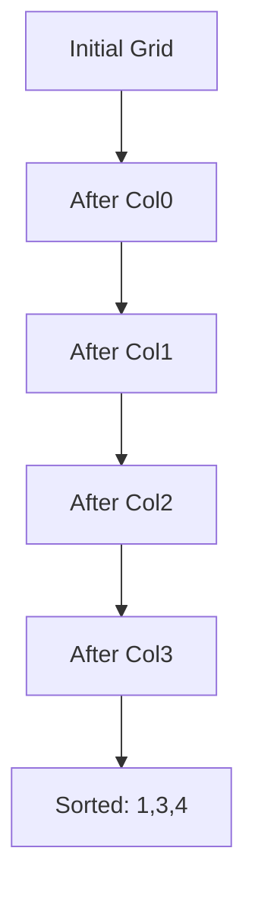
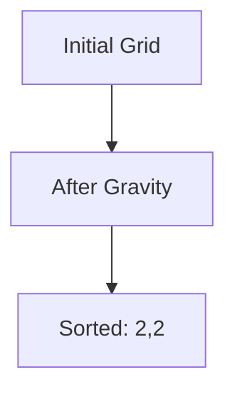

## 1. One-line summary (what it does, when to use it).
Bead sort is a natural sorting algorithm that sorts a list of non-negative integers in ascending order by simulating beads falling under gravity; use it for educational purposes or when visualizing sorting with physical analogies, but not for efficiency in software.

## 2. Intuition and real-world analogy (1–2 sentences).
Imagine an abacus where each number in your list is represented as a row of beads on horizontal wires, with the number of beads equal to the value. When you turn it sideways and let gravity pull the beads down the vertical poles, they naturally stack up at the bottom, forming new rows where the lengths represent the sorted values.

## 3. Formal definition and key properties.
Bead sort, also known as gravity sort or abacus sort, is a comparison-free sorting algorithm that works exclusively on lists of non-negative integers. Key properties include: it mimics physical processes for sorting, produces stable sorted output in ascending order, requires knowledge of the maximum value in the list, and is not practical for large datasets in software due to high time and space demands, but can theoretically be O(n) in specialized hardware.

## 4. Required operations (e.g., insert/search/delete) and what they do.
Bead sort is primarily a sorting algorithm rather than a data structure, so its main operation is **sort**, which rearranges a list of non-negative integers into ascending order. It does not support dynamic operations like insert, search, or delete directly; the entire list must be provided upfront for batch sorting.

## 5. Step-by-step algorithm walkthrough.
1. **Find the maximum value and list length**: Determine the largest number (max_val) in the input list and the number of elements (n). This sets up the grid size.  
   Example with input [3, 1, 2]: max_val = 3, n = 3. No intermediate state yet.

2. **Create a grid for beads**: Build a 2D grid with n rows (one per number) and max_val columns, initialized to 0 (empty).  
   Example:  
   ```
   Row 0: 0 0 0
   Row 1: 0 0 0
   Row 2: 0 0 0
   ```

3. **Place beads for each number**: For each number in the list, set the first 'number' positions in its row to 1 (bead present).  
   Example (for 3 in row 0, 1 in row 1, 2 in row 2):  
   ```
   Row 0: 1 1 1  (for 3)
   Row 1: 1 0 0  (for 1)
   Row 2: 1 1 0  (for 2)
   ```

4. **Simulate gravity on each column**: For each column, count the total beads (1s), clear the column to 0s, then place that many 1s at the bottom of the column (from row n - count to n-1).  
   Example:  
   - Column 0: beads = 1+1+1=3, clear, place 1s in rows 0-2: all 1s.  
   - Column 1: beads = 1+0+1=2, clear, place 1s in rows 1-2.  
   - Column 2: beads = 1+0+0=1, clear, place 1 in row 2.  
   After:  
   ```
   Row 0: 1 0 0
   Row 1: 1 1 0
   Row 2: 1 1 1
   ```

5. **Read the sorted list from row sums**: Count the 1s in each row to get the sorted values.  
   Example: Row 0: 1 (sum=1), Row 1: 2 (sum=2), Row 2: 3 (sum=3). Sorted: [1, 2, 3].

## 6. Pseudocode (clear, short).
```
function bead_sort(list):
    if any negative in list: error "Non-negative only"
    n = length(list)
    max_val = max(list)
    grid = 2D array of zeros [n rows, max_val columns]
    for i from 0 to n-1:
        for j from 0 to list[i]-1:
            grid[i][j] = 1
    for j from 0 to max_val-1:
        count = sum grid[k][j] for k=0 to n-1
        for k from 0 to n-1:
            grid[k][j] = 0
        for k from n-count to n-1:
            grid[k][j] = 1
    sorted = []
    for i from 0 to n-1:
        sorted.append(sum grid[i])
    return sorted
```

## 7. Two runnable implementations.
### Short, idiomatic version in Python.
```python
def bead_sort(seq):
    if any(n < 0 for n in seq):
        raise ValueError("All numbers must be non-negative.")
    max_val = max(seq) if seq else 0
    n = len(seq)
    frame = [[0] * max_val for _ in range(n)]
    for i, num in enumerate(seq):
        for j in range(num):
            frame[i][j] = 1
    for j in range(max_val):
        col_sum = sum(frame[i][j] for i in range(n))
        for i in range(n):
            frame[i][j] = 0
        for i in range(n - col_sum, n):
            frame[i][j] = 1
    return [sum(row) for row in frame]
```

### A commented version suitable for learners.
```python
def bead_sort(seq):
    # Check for negative numbers, as bead sort only works with non-negative integers
    if any(n < 0 for n in seq):
        raise ValueError("All numbers must be non-negative.")
    
    # Handle empty list case
    if not seq:
        return []
    
    # Find the maximum value and number of elements
    max_val = max(seq)
    n = len(seq)
    
    # Create a grid: rows for each number, columns up to max_val
    # 1 means bead present, 0 means empty
    frame = [[0] * max_val for _ in range(n)]
    
    # Place beads: for each number, fill its row with 1s up to its value
    for i, num in enumerate(seq):
        for j in range(num):
            frame[i][j] = 1
    
    # Simulate gravity for each column
    for j in range(max_val):
        # Count beads in this column
        col_sum = sum(frame[i][j] for i in range(n))
        # Clear the column
        for i in range(n):
            frame[i][j] = 0
        # Place beads at the bottom
        for i in range(n - col_sum, n):
            frame[i][j] = 1
    
    # Read sorted values: sum 1s in each row
    sorted_seq = [sum(row) for row in frame]
    return sorted_seq
```

## 8. One or two complete worked examples that trace every intermediate state (show arrays/queues/pointers etc.).
### Example 1: Sorting [4, 1, 3]
- **Initial**: list = [4, 1, 3], n=3, max_val=4
- **Grid after placing beads**:
  | Row | Col0 | Col1 | Col2 | Col3 |
  |-----|------|------|------|------|
  | 0   | 1    | 1    | 1    | 1    |  (for 4)
  | 1   | 1    | 0    | 0    | 0    |  (for 1)
  | 2   | 1    | 1    | 1    | 0    |  (for 3)

- **After gravity on Col0**: count=3, place bottom: rows 0-2 =1
  | Row | Col0 | Col1 | Col2 | Col3 |
  |-----|------|------|------|------|
  | 0   | 1    | 1    | 1    | 1    |
  | 1   | 1    | 0    | 0    | 0    |
  | 2   | 1    | 1    | 1    | 0    |

- **After gravity on Col1**: count=2, place bottom: rows 1-2 =1
  | Row | Col0 | Col1 | Col2 | Col3 |
  |-----|------|------|------|------|
  | 0   | 1    | 0    | 1    | 1    |
  | 1   | 1    | 1    | 0    | 0    |
  | 2   | 1    | 1    | 1    | 0    |

- **After gravity on Col2**: count=2, place bottom: rows 1-2 =1
  | Row | Col0 | Col1 | Col2 | Col3 |
  |-----|------|------|------|------|
  | 0   | 1    | 0    | 0    | 1    |
  | 1   | 1    | 1    | 1    | 0    |
  | 2   | 1    | 1    | 1    | 0    |

- **After gravity on Col3**: count=1, place bottom: row 2 =1
  | Row | Col0 | Col1 | Col2 | Col3 |
  |-----|------|------|------|------|
  | 0   | 1    | 0    | 0    | 0    |
  | 1   | 1    | 1    | 1    | 0    |
  | 2   | 1    | 1    | 1    | 1    |

- **Final sums**: Row0=1, Row1=3, Row2=4 → [1, 3, 4]



ASCII fallback:
```
Initial:
1 1 1 1
1 0 0 0
1 1 1 0

After all gravity:
1 0 0 0
1 1 1 0
1 1 1 1
```

### Example 2: Sorting [2, 2]
- **Initial**: list = [2, 2], n=2, max_val=2
- **Grid after placing beads**:
  | Row | Col0 | Col1 |
  |-----|------|------|
  | 0   | 1    | 1    |
  | 1   | 1    | 1    |

- **After gravity on Col0**: count=2, place bottom: rows 0-1 =1 (no change)
- **After gravity on Col1**: count=2, place bottom: rows 0-1 =1 (no change)
- **Final sums**: Row0=2, Row1=2 → [2, 2]



ASCII fallback:
```
Initial and Final:
1 1
1 1
```

## 9. Complexity: best/average/worst time and space; explain why.
- **Time**: Best/average/worst O(n * m), where n is list length and m is max value; this is because placing beads takes O(n * m), gravity simulation loops over all columns and rows O(m * n), and reading sums O(n * m). No better or worse cases since it always processes the full grid.
- **Space**: O(n * m), due to the 2D grid storing beads for all positions up to max value; this can be high if max is large compared to n.

## 10. Correctness sketch or invariant (one paragraph).
The algorithm maintains the invariant that the total number of beads (1s) remains constant throughout, equal to the sum of the input values. Initially, beads are placed horizontally per input number. During gravity, beads in each column are counted and repositioned to the bottom without loss or gain, preserving the total per column. After all columns are processed, the beads are stacked at the bottom across columns, so the row sums now represent the input values redistributed such that upper rows have fewer beads (smaller numbers) and lower rows have more (larger numbers), resulting in ascending order when read from top to bottom.

## 11. Common pitfalls, edge cases, and variations/optimizations.
- **Common pitfalls**: Forgetting to handle negative numbers (throws error) or zero (works but grid may be empty); assuming it works for floats or non-integers (it doesn't).
- **Edge cases**: Empty list → empty output; all zeros [0,0] → [0,0] (max=0, no grid); single element [5] → [5]; duplicates like [1,1,1] → [1,1,1].
- **Variations/optimizations**: Use a 1D array for beads as counts per pole (O(m + n * s) where s is sum), avoiding full grid for space; hardware versions with parallel falling beads achieve O(n) time; reverse for descending sort.

## 12. 2 practice problems (one easy, one medium) with brief solutions.
- **Easy**: Sort [5, 3, 0, 2] using bead sort.  
  **Solution**: max=5, n=4. After placing: rows [11111, 11100, 00000, 11000]. After gravity: beads stack bottom, sums [0,2,3,5]. Output: [0, 2, 3, 5].

- **Medium**: Modify the algorithm to handle up to 1 duplicate max value efficiently, then sort [4, 1, 4, 2].  
  **Solution**: Standard works: max=4, n=4. Placing: [1111,1000,1111,1100]. Gravity stacks: sums [1,2,4,4]. Output: [1, 2, 4, 4]. No special mod needed, but for optimization, count-based: poles [4>=1:4, >=2:4, >=3:2, >=4:2], then for i=1 to4: count poles >=i → for i=1:4, i=2:4, i=3:2, i=4:2, then reverse to ascending [2,2,4,4] wait, adjust: actually use cumulative to get values.

## 13. Short cheat-sheet at the end (3–5 bullet points) and recommended next topics.
- Works only on non-negative integers; finds max to build grid.
- Places beads horizontally, then drops vertically with gravity simulation.
- Time O(n*m), space O(n*m); better in hardware.
- Output: row sums after gravity give ascending sorted list.
- Recommended next topics: Counting sort (similar for integers), Bubble sort (simple comparison-based).