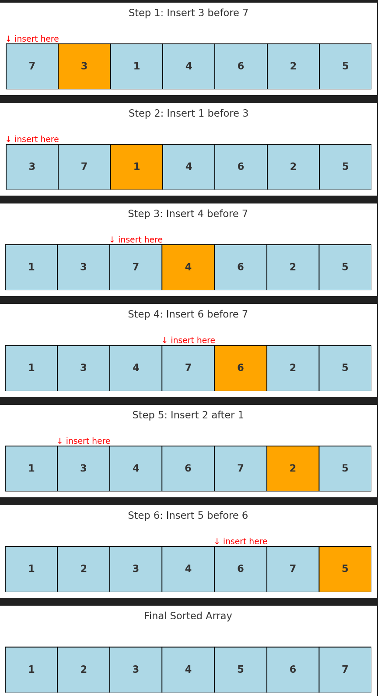

# 🔢 Binary Insertion Sort

---

## 📌 Definition

**Binary Insertion Sort** is a variation of **Insertion Sort** where the position to insert an element is found using **Binary Search** instead of linear search.

* It still maintains **O(n²)** complexity due to shifting elements.
* The improvement comes in reducing the number of *comparisons* (from O(n) to O(log n)).

---

## 🧠 Intuition

* In normal **Insertion Sort**, you scan leftwards one-by-one to find the correct spot.
* In **Binary Insertion Sort**, you **binary search** the left (sorted) part to quickly find the insertion point.
* However, even if the position is found faster, you still need to **shift elements** to insert — that’s the bottleneck.

> Think of inserting books into a sorted shelf:
>
> * Normal Insertion Sort: check books one by one until you find the right place.
> * Binary Insertion Sort: use a “middle check” strategy to find the place faster — but you still must move all the books over to make space.

---

## ⚙️ Algorithm Steps

1. Start with the **second element** (first is trivially sorted).
2. Perform **Binary Search** on the sorted left sublist to find the correct insertion index.
3. **Shift elements** in the array to the right to make room.
4. Insert the element.
5. Repeat for all elements until the array is sorted.

---

## 📊 Example Walkthrough

Suppose we want to sort:

```
[7, 3, 1, 4, 6, 2, 5]
```

### Step-by-step:

1. **Pick 3** → Binary search `[7]` → insert before → `[3, 7, 1, 4, 6, 2, 5]`
2. **Pick 1** → Binary search `[3, 7]` → insert before 3 → `[1, 3, 7, 4, 6, 2, 5]`
3. **Pick 4** → Binary search `[1, 3, 7]` → insert before 7 → `[1, 3, 4, 7, 6, 2, 5]`
4. **Pick 6** → Binary search `[1, 3, 4, 7]` → insert before 7 → `[1, 3, 4, 6, 7, 2, 5]`
5. **Pick 2** → Binary search `[1, 3, 4, 6, 7]` → insert after 1 → `[1, 2, 3, 4, 6, 7, 5]`
6. **Pick 5** → Binary search `[1, 2, 3, 4, 6, 7]` → insert before 6 → `[1, 2, 3, 4, 5, 6, 7]`

✅ Sorted result: `[1, 2, 3, 4, 5, 6, 7]`

---

## 🖥️ Pseudocode

```python
def binary_insertion_sort(arr):
    for i in range(1, len(arr)):
        key = arr[i]
        # Binary Search to find insertion index
        left, right = 0, i - 1
        while left <= right:
            mid = (left + right) // 2
            if arr[mid] > key:
                right = mid - 1
            else:
                left = mid + 1
        
        # Shift elements to make room
        j = i - 1
        while j >= left:
            arr[j + 1] = arr[j]
            j -= 1
        
        arr[left] = key
    return arr
```

---

## ⏱️ Complexity Analysis

| Operation         | Best Case | Worst Case |
| ----------------- | --------- | ---------- |
| **Comparisons**   | O(1)      | O(log n)   |
| **Shifts**        | O(n)      | O(n)       |
| **Total Runtime** | O(n²)     | O(n²)      |

⚡ Comparisons are reduced compared to **Insertion Sort**, but the **shifting cost** keeps the algorithm quadratic.

---

## 📌 Key Notes

* **Improves comparisons**, not overall time complexity.
* Still **O(n²)** because shifting dominates.
* Useful as a **learning step** towards more efficient algorithms (like Merge Sort or Quick Sort).

---
Here are the **step-by-step diagrams** of **Binary Insertion Sort** in action:


* 🔶 Orange = current element being inserted
* 🔻 Red arrow = insertion position

Each image shows the array after inserting one element.

