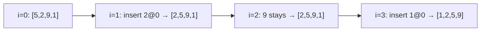

1. One-line summary  
Binary insertion sort keeps the left part of the list already sorted and, for every new item, finds its correct slot with **binary search** instead of a linear scan—fast when comparisons are expensive and the list is small or almost sorted.

2. Intuition and real-world analogy  
Think of organizing a hand of playing-cards: you already keep the cards in order; instead of sliding each new card left one-by-one until it fits, you **“split the row in half”** repeatedly to decide where it belongs, then just insert it.

3. Formal definition and key properties  
- Stable, in-place comparison sort.  
- Maintains `[0…i-1]` sorted; inserts `A[i]` into that prefix.  
- Uses **binary search** on the prefix to find the insertion index.  
- Worst-case comparisons: `O(log i)` for the search plus `O(i)` data moves.

4. Required operations  
| Operation | Purpose | Built-in Python helper |
|-----------|---------|------------------------|
| **Binary search** | Locate insertion index in sorted prefix | `bisect_left` |
| **Shift/insert** | Slide larger elements right & drop new element | slice assignment or `list.insert` |

5. Step-by-step algorithm walkthrough  
Let’s sort `[34, 12, 50, 7, 23]` (index 0 is trivially sorted already).

| Step | Plain-English | Array state (sorted part in bold) |
|------|---------------|-----------------------------------|
| 1 | Start with 2nd item (i=1). Binary-search **bold** part `[34]` → 12 belongs at 0. Shift 34 right, insert 12. | `[12, 34, 50, 7, 23]` |
| 2 | i=2. Search `[12,34]` → 50 already in place. Nothing moves. | `[12, 34, 50, 7, 23]` |
| 3 | i=3. Search `[12,34,50]` → 7 belongs at 0. Shift all right, insert 7. | `[7, 12, 34, 50, 23]` |
| 4 | i=4. Search `[7,12,34,50]` → 23 belongs at index 2. Shift 34 & 50 right, insert 23. | `[7, 12, 23, 34, 50]` |

6. Pseudocode  
```
for i = 1 to n-1
    key = A[i]
    left = 0, right = i
    while left < right          // binary search
        mid = (left + right) // 2
        if A[mid] < key
            left = mid + 1
        else
            right = mid
    // shift A[left … i-1] one cell right
    for j = i downto left+1
        A[j] = A[j-1]
    A[left] = key
```

7. Runnable implementations  

**Short, idiomatic (Python):**
```python
from bisect import insort

def binary_insertion_sort(a):
    for i in range(1, len(a)):
        key = a[i]
        del a[i]          # remove to avoid duplicate
        insort(a, key, 0, i)   # binary locate + insert
```

**Learner-friendly, fully commented:**
```python
def binary_insertion_sort(a):
    """Sort list `a` in place using binary insertion sort."""
    n = len(a)
    for i in range(1, n):
        key = a[i]                 # item to insert
        left, right = 0, i         # search inside prefix [0..i-1]

        # ----- binary search -----
        while left < right:
            mid = (left + right) // 2
            if a[mid] < key:       # key belongs to the right half
                left = mid + 1
            else:                  # key belongs to the left half (<=)
                right = mid
        # left is the insertion index

        # ----- shift & insert -----
        for j in range(i, left, -1):  # slide larger items right
            a[j] = a[j-1]
        a[left] = key
```

8. Complete worked example  
Sort `[5, 2, 9, 1]` (indices 0…3).

**Textual trace:**

| i | key | Binary search result (left) | Array after shift & insert |
|---|-----|-----------------------------|----------------------------|
| 1 | 2   | 0                           | `[2, 5, 9, 1]` |
| 2 | 9   | 2                           | `[2, 5, 9, 1]` (no shift needed) |
| 3 | 1   | 0                           | `[1, 2, 5, 9]` |

**Mermaid diagram (state per outer loop):**


ASCII fallback:
```
Step 0: [5, 2, 9, 1]
Step 1: [2, 5, 9, 1]
Step 2: [2, 5, 9, 1]
Step 3: [1, 2, 5, 9]
```

9. Complexity  
| Case | Comparisons | Data moves | Total time | Space |
|------|-------------|------------|------------|-------|
| Best | Σlog i ≈ n log n | 0 | **O(n log n)** | O(1) |
| Avg  | Σlog i ≈ n log n | Σi/2 ≈ n²/4 | **O(n²)** | O(1) |
| Worst| Σlog i ≈ n log n | Σi ≈ n²/2 | **O(n²)** | O(1) |

Binary search only reduces comparisons; shifting elements still costs O(i) per insertion.

10. Correctness sketch  
Loop invariant: after each outer iteration `i`, sub-array `A[0…i]` is sorted.  
- **Initialization:** `i=0` is length 1 ⇒ sorted.  
- **Maintenance:** binary search finds the unique index `left` where all preceding elements ≤ key and succeeding > key; shifting preserves order, and placing key at `left` extends the sorted prefix.  
- **Termination:** `i=n-1` ⇒ entire array sorted. Stability follows because equal elements are inserted to the right of existing ones (via `<=` in search).

11. Common pitfalls & tips  
- Forgetting stability: use `bisect_right` if you need to keep duplicates in original order.  
- Off-by-one in binary bounds (`right = i` not `i-1`).  
- Large arrays → O(n²) moves hurt; switch to merge/heap sort.  
- Optimization: use **linked lists** to avoid shifts (but lose cache locality).  
- Hybrid: use binary insertion sort for tiny sub-arrays inside quicksort (`n ≤ 32`).

12. Practice problems  

**Easy**  
Write `is_stable_sorted(a)` that returns `True` iff `a` is sorted and equal items keep their original relative order. (Hint: compare with sorted copy and check indices.)

**Medium**  
Implement **binary insertion sort on a singly linked list** without converting to an array. Provide complexity analysis.  
*(Solution sketch: walk list to count length, then for each node perform binary search by index (O(log i) time to locate position) and splice-node insert (O(i) time to reach index); overall still O(n²) but no extra array.)*

13. Cheat-sheet  
- Left part always sorted; new item located by **binary search**.  
- Shifts still cost O(n²) in worst case.  
- Stable, in-place, tiny code.  
- Best when **n < ~30** or list almost sorted & comparisons expensive.  
- Next topics: merge sort (divide & conquer), `bisect` module tricks, introsort.