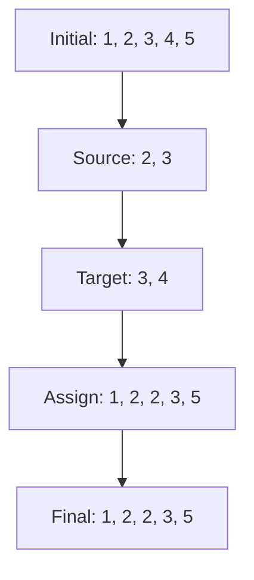
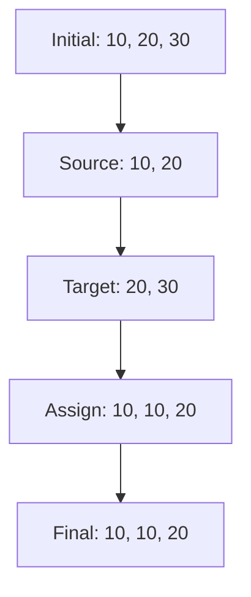

# Explaining Array Slicing and Assignment in Python

## 1. One-line Summary
The Python code `arr[j + 1:i + 1] = arr[j:i]` copies a slice of an array from indices `j` to `i-1` into positions `j+1` to `i`, shifting elements right to make space.

## 2. Intuition and Real-world Analogy
Think of a line of people where you want to duplicate a group (like copying a few friends’ names) and insert them right after their original spot, pushing others down the line. This operation shifts elements in an array to make room for a copied segment.

## 3. Formal Definition and Key Properties
This operation involves slicing an array (`arr[j:i]`) to extract elements from index `j` to `i-1` and assigning them to a new slice (`arr[j + 1:i + 1]`), effectively inserting the copied segment and shifting subsequent elements right.
- **Key Properties**:
  - Works on Python lists (mutable sequences).
  - Preserves the original elements in `arr[j:i]`.
  - Shifts elements starting at `j+1` to accommodate the copied slice.
  - The slice lengths must match (`i - j` elements).

## 4. Required Operations
- **Slice Extraction (`arr[j:i]`)**: Retrieves elements from index `j` to `i-1`.
- **Slice Assignment (`arr[j + 1:i + 1] = ...`)**: Replaces elements from `j+1` to `i` with the extracted slice, shifting later elements right.
- **Shift**: Implicitly handled by Python, moving elements to the right to fit the new slice.

## 5. Step-by-step Algorithm Walkthrough
Let’s walk through `arr[j + 1:i + 1] = arr[j:i]` with `arr = [1, 2, 3, 4, 5]`, `j = 1`, `i = 3`.

1. **Identify the source slice (`arr[j:i]`)**
   - Extract elements from index `j` (1) to `i-1` (2).
   - **Example**: `arr[1:3]` = `[2, 3]`.

   | Index | 0 | 1 | 2 | 3 | 4 |
   |-------|---|---|---|---|---|
   | Value | 1 | 2 | 3 | 4 | 5 |
   | Note  |   | j |   | i |   |

2. **Identify the target slice (`arr[j + 1:i + 1]`)**
   - Target is from index `j+1` (2) to `i` (3).
   - **Example**: `arr[2:4]` (positions for `[3, 4]`).

   | Index | 0 | 1 | 2 | 3 | 4 |
   |-------|---|---|---|---|---|
   | Value | 1 | 2 | 3 | 4 | 5 |
   | Note  |   |   |j+1| i |   |

3. **Assign the source slice to the target slice**
   - Copy `[2, 3]` to `arr[2:4]`, replacing `[3, 4]` and shifting subsequent elements right.
   - **Example**: After assignment, `arr` becomes `[1, 2, 2, 3, 5]`.

   | Index | 0 | 1 | 2 | 3 | 4 |
   |-------|---|---|---|---|---|
   | Value | 1 | 2 | 2 | 3 | 5 |
   | Note  |   |   |j+1| i |   |

4. **Shift remaining elements**
   - Python automatically shifts elements after `i` (e.g., `5` moves right).
   - **Example**: No further elements need manual shifting here.

   | Index | 0 | 1 | 2 | 3 | 4 |
   |-------|---|---|---|---|---|
   | Value | 1 | 2 | 2 | 3 | 5 |

**Mermaid Diagram for Visualization**:


**ASCII Fallback**:
```
Step 1: Source [2, 3]
  [1, 2, 3, 4, 5]
       ^  ^
       j  i
Step 2: Target [3, 4]
  [1, 2, 3, 4, 5]
          ^  ^
         j+1 i
Step 3: Assign [2, 3]
  [1, 2, 2, 3, 5]
Step 4: Final
  [1, 2, 2, 3, 5]
```

## 6. Pseudocode
```
1. Extract slice from arr[j] to arr[i-1]  // Source slice
2. Assign extracted slice to arr[j+1] to arr[i]  // Copy and shift
3. Return modified array
```

## 7. Two Runnable Implementations

### Short, Idiomatic Version
```python
def copy_slice(arr, j, i):
    arr[j + 1:i + 1] = arr[j:i]
    return arr
```

### Commented Version for Learners
```python
def copy_slice(arr, j, i):
    # arr: input list
    # j: start index of source slice
    # i: end index of source slice (exclusive)
    
    # Step 1: Get slice from j to i-1 (e.g., arr[1:3] gets elements at 1, 2)
    source = arr[j:i]
    
    # Step 2: Assign source to positions j+1 to i, shifting others right
    arr[j + 1:i + 1] = source
    
    # Step 3: Return the modified list
    return arr
```

## 8. Complete Worked Examples

### Example 1: `arr = [1, 2, 3, 4, 5]`, `j = 1`, `i = 3`
| Step | Array State | Description |
|------|-------------|-------------|
| Initial | `[1, 2, 3, 4, 5]` | Start with original array. |
| Source Slice | `[2, 3]` | Extract `arr[1:3]` (indices 1 to 2). |
| Target Slice | `[3, 4]` | Identify `arr[2:4]` (indices 2 to 3) as target. |
| Assign | `[1, 2, 2, 3, 5]` | Copy `[2, 3]` to `arr[2:4]`, shift `5` right. |
| Final | `[1, 2, 2, 3, 5]` | Result after operation. |

**Mermaid Diagram**:


**ASCII Fallback**:
```
Initial: [1, 2, 3, 4, 5]
         j=1 ^  ^ i=3
Source: [2, 3]
Target: [3, 4]
Assign: [1, 2, 2, 3, 5]
Final:  [1, 2, 2, 3, 5]
```

### Example 2: `arr = [10, 20, 30]`, `j = 0`, `i = 2`
| Step | Array State | Description |
|------|-------------|-------------|
| Initial | `[10, 20, 30]` | Start with original array. |
| Source Slice | `[10, 20]` | Extract `arr[0:2]` (indices 0 to 1). |
| Target Slice | `[20, 30]` | Identify `arr[1:3]` (indices 1 to 2) as target. |
| Assign | `[10, 10, 20]` | Copy `[10, 20]` to `arr[1:3]`, overwrite `30`. |
| Final | `[10, 10, 20]` | Result after operation. |

**Mermaid Diagram**:
```mermaid
graph TD
    A[Initial: [10, 20, 30]] --> B[Source: [10, 20]]
    B --> C[Target: [20, 30]]
    C --> D[Assign: [10, 10, 20]]
    D --> E[Final: [10, 10, 20]]
```

**ASCII Fallback**:
```
Initial: [10, 20, 30]
         j=0 ^  ^ i=2
Source: [10, 20]
Target: [20, 30]
Assign: [10, 10, 20]
Final:  [10, 10, 20]
```

## 9. Complexity
- **Time Complexity**:
  - **Best/Average/Worst**: O(n), where `n` is the length of the array. Python’s slice assignment involves copying `i-j` elements and shifting `n-(i+1)` elements right.
  - **Why**: Copying the slice and shifting elements require iterating over portions of the array.
- **Space Complexity**:
  - **Best/Average/Worst**: O(i-j) for the temporary slice `arr[j:i]`.
  - **Why**: Python creates a new list for the source slice before assignment.

## 10. Correctness Sketch
The operation maintains the invariant that the source slice `arr[j:i]` is correctly copied to `arr[j+1:i+1]`, preserving all elements before `j` and after `i` while shifting elements as needed. Python’s list implementation ensures that the slice lengths match (`i-j`) and that elements are shifted right to accommodate the assignment without data loss, except for elements overwritten in the target slice.

## 11. Common Pitfalls, Edge Cases, and Variations
- **Pitfalls**:
  - Assuming `i` or `j` can be negative without proper handling.
  - Using invalid indices (`j >= i` or `i > len(arr)`), causing errors.
- **Edge Cases**:
  - Empty slice (`j == i`): No effect, as `arr[j:i]` is empty.
  - Full array (`j = 0`, `i = len(arr)`): Copies entire array, potentially overwriting all elements.
  - Out-of-bounds indices: Raises `IndexError`.
- **Variations/Optimizations**:
  - Use in-place modifications to avoid temporary slice creation (not possible in pure Python).
  - For large arrays, consider manual looping to control memory usage.

## 12. Practice Problems

### Easy: Copy First Two Elements
**Problem**: Given `arr = [1, 2, 3, 4]`, apply `arr[1:3] = arr[0:2]` and return the result.
**Solution**:
```python
arr = [1, 2, 3, 4]
arr[1:3] = arr[0:2]  # Copy [1, 2] to positions 1 and 2
# Result: [1, 1, 2, 4]
```

### Medium: Dynamic Indices
**Problem**: Write a function that takes `arr`, `j`, `i` and applies `arr[j+1:i+1] = arr[j:i]`. Handle invalid indices.
**Solution**:
```python
def safe_copy_slice(arr, j, i):
    if j < 0 or i > len(arr) or j >= i:
        return arr  # Invalid indices, return unchanged
    arr[j + 1:i + 1] = arr[j:i]
    return arr

arr = [1, 2, 3, 4, 5]
print(safe_copy_slice(arr, 1, 3))  # Output: [1, 2, 2, 3, 5]
```

## 13. Cheat-sheet and Recommended Next Topics
- **Cheat-sheet**:
  - `arr[j:i]` extracts elements from index `j` to `i-1`.
  - `arr[j+1:i+1] = arr[j:i]` copies slice and shifts elements right.
  - Ensure `0 <= j < i <= len(arr)` to avoid errors.
  - Time complexity: O(n) due to copying and shifting.
  - Space complexity: O(i-j) for temporary slice.
- **Recommended Next Topics**:
  - Python list methods (e.g., `insert`, `extend`).
  - Array rotation algorithms.