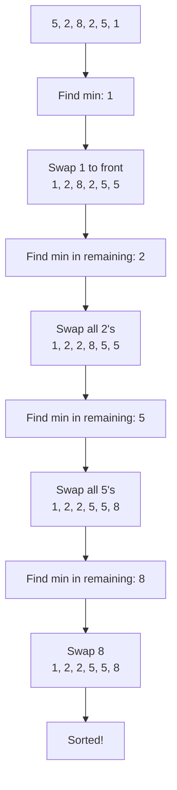

1. **One-line summary**: Bingo Sort is a variant of selection sort that minimizes swaps by first finding the smallest element and then moving all occurrences of it to the front in one pass, repeating for the next smallest distinct value.

2. **Intuition and real-world analogy**: Like sorting a deck of cards by repeatedly finding all cards of the lowest remaining rank (e.g., all 2s, then all 3s) and moving them to the sorted pile.

3. **Formal definition and key properties**: 
   - Unstable comparison-based sort (though can be made stable with careful implementation).
   - Efficient when the input has many duplicate elements.
   - Works by repeatedly finding the minimum element and swapping all its occurrences to the current position.

4. **Required operations**:
   - **Find minimum**: Scan the unsorted portion to find the smallest element.
   - **Swap multiple elements**: Move all occurrences of this minimum value to the front.

5. **Step-by-step algorithm walkthrough**:
   Let's sort `[5, 2, 8, 2, 5, 1]`:
   
   1. Find minimum in entire array: `min_value = 1`
   2. Swap `1` with first element: `[1, 2, 8, 2, 5, 5]`
   3. Find next minimum in remaining unsorted portion (index 1+): `min_value = 2`
   4. Swap all `2`s to current position: first swap `2` at index 1 with itself (no change), then swap `2` at index 3 with element at index 2: `[1, 2, 2, 8, 5, 5]`
   5. Find next minimum in remaining portion (index 3+): `min_value = 5`
   6. Swap all `5`s to position: swap `5` at index 4 with element at index 3: `[1, 2, 2, 5, 8, 5]`, then swap `5` at index 5 with element at index 4: `[1, 2, 2, 5, 5, 8]`
   7. Find next minimum: `min_value = 8`
   8. Swap remaining element (already in place)

6. **Pseudocode**:
```
function bingo_sort(arr):
    n = length(arr)
    start = 0
    
    while start < n:
        # Find min in unsorted portion
        min_val = arr[start]
        for i from start to n-1:
            if arr[i] < min_val:
                min_val = arr[i]
        
        # Swap all occurrences of min_val to current position
        j = start
        for i from start to n-1:
            if arr[i] == min_val:
                swap arr[i] and arr[j]
                j = j + 1
        
        start = j
```

7. **Implementations**:

**Short version**:
```python
def bingo_sort(arr):
    n = len(arr)
    start = 0
    while start < n:
        min_val = min(arr[start:])
        j = start
        for i in range(start, n):
            if arr[i] == min_val:
                arr[i], arr[j] = arr[j], arr[i]
                j += 1
        start = j
    return arr
```

**Commented version**:
```python
def bingo_sort(arr):
    n = len(arr)
    start = 0  # Start of unsorted portion
    
    while start < n:
        # Find minimum value in unsorted portion
        min_val = min(arr[start:])
        
        # Move all occurrences of min_val to the front
        j = start  # Position to place next min_val
        for i in range(start, n):
            if arr[i] == min_val:
                # Swap element to correct position
                arr[i], arr[j] = arr[j], arr[i]
                j += 1
        
        # Move start to after the sorted min values
        start = j
    
    return arr
```

8. **Complete worked example**:

Sorting `[5, 2, 8, 2, 5, 1]`:

| Step | Action | Array State | Start | j |
|------|--------|-------------|-------|---|
| 0 | Initial array | `[5, 2, 8, 2, 5, 1]` | 0 | - |
| 1 | Find min = 1 | `[5, 2, 8, 2, 5, 1]` | 0 | - |
| 2 | Swap 1 to front | `[1, 2, 8, 2, 5, 5]` | 0 | 1 |
| 3 | Find min in remaining = 2 | `[1, 2, 8, 2, 5, 5]` | 1 | - |
| 4 | Swap first 2 (no change) | `[1, 2, 8, 2, 5, 5]` | 1 | 2 |
| 5 | Swap second 2 | `[1, 2, 2, 8, 5, 5]` | 1 | 3 |
| 6 | Find min in remaining = 5 | `[1, 2, 2, 8, 5, 5]` | 3 | - |
| 7 | Swap first 5 | `[1, 2, 2, 5, 8, 5]` | 3 | 4 |
| 8 | Swap second 5 | `[1, 2, 2, 5, 5, 8]` | 3 | 5 |
| 9 | Find min in remaining = 8 | `[1, 2, 2, 5, 5, 8]` | 5 | - |
|10| Swap 8 (no change) | `[1, 2, 2, 5, 5, 8]` | 5 | 6 |

**Mermaid diagram**:


9. **Complexity**:
   - **Time**: O(n²) in all cases (similar to selection sort)
   - **Space**: O(1) (in-place sorting)
   - The algorithm performs better than selection sort when there are many duplicates, as it moves all occurrences of the minimum value in one pass.

10. **Correctness sketch**: The invariant is that after each iteration, all elements before `start` are sorted and contain the smallest distinct values in the array. The algorithm guarantees that each distinct value is placed in its correct final position in the order they appear in the sorted array.

11. **Common pitfalls and variations**:
   - **Pitfall**: Forgetting to update `start` correctly after moving all occurrences of the minimum value.
   - **Optimization**: Can be modified to be stable by using a different swapping strategy.
   - **Variation**: Can be implemented recursively, though iterative is more space-efficient.

12. **Practice problems**:
   - **Easy**: Sort `[3, 1, 4, 1, 5, 9, 2, 6]` using bingo sort. Show each step.
   - **Medium**: Implement a stable version of bingo sort that preserves the original order of equal elements.

**Easy solution**:
```python
# Step-by-step for [3, 1, 4, 1, 5, 9, 2, 6]:
# 1. Find min=1, swap both 1's to front: [1, 1, 4, 3, 5, 9, 2, 6]
# 2. Find min=2 in remaining, swap: [1, 1, 2, 3, 5, 9, 4, 6]  
# 3. Find min=3, swap: [1, 1, 2, 3, 5, 9, 4, 6]
# 4. Find min=4, swap: [1, 1, 2, 3, 4, 9, 5, 6]
# 5. Find min=5, swap: [1, 1, 2, 3, 4, 5, 9, 6]
# 6. Find min=6, swap: [1, 1, 2, 3, 4, 5, 6, 9]
# 7. Find min=9, swap: [1, 1, 2, 3, 4, 5, 6, 9]
```

13. **Cheat-sheet**:
   - Variant of selection sort that handles duplicates efficiently
   - Time: O(n²), Space: O(1)
   - Good for arrays with many duplicate values
   - Not stable by default, but can be modified to be stable
   - Next topics: Counting sort, Radix sort, other distribution sorts