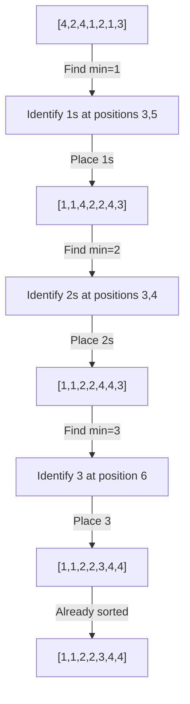

# Bingo Sort

## 1. One-line Summary
Bingo Sort is a variant of Selection Sort that efficiently handles duplicates by moving all occurrences of the minimum element to their final positions in one pass.

## 2. Intuition and Real-world Analogy
Imagine sorting a deck of cards where you have multiple cards of the same value - instead of moving identical cards one by one, you gather all the 2s, then all the 3s, and so on, placing each group at once.

## 3. Formal Definition and Key Properties
**Definition**: Bingo Sort repeatedly finds the minimum element in the unsorted portion and moves ALL occurrences of that minimum to their correct positions simultaneously.

**Key Properties**:
- ✅ **In-place sorting**: $O(1)$ extra space
- ✅ **Stable**: Maintains relative order of equal elements
- ✅ **Adaptive**: Performs better with many duplicates
- ❌ **Not optimal** for unique elements

## 4. Required Operations

| Operation | Description |
|-----------|-------------|
| **Find Min** | Locate the smallest element in unsorted portion |
| **Count Occurrences** | Count how many times the minimum appears |
| **Shift Elements** | Move all instances of minimum to correct positions |
| **Update Boundaries** | Adjust the unsorted region after placing elements |

## 5. Step-by-Step Algorithm Walkthrough

### **Step 1: Initialize**
Set the starting position for sorted portion to 0.

**Example**: Array = `[3, 5, 3, 2, 5, 2]`
Position: 0
Array: [3, 5, 3, 2, 5, 2]
       ^


### **Step 2: Find Minimum and Count**
Scan unsorted portion to find minimum value and count its occurrences.

**Example**: 
Minimum found: 2 (appears 2 times)
Array: [3, 5, 3, 2, 5, 2]
                 ^     ^


### **Step 3: Place All Minimums**
Move all occurrences of the minimum to the beginning of unsorted portion.

**Example**:
Before: [3, 5, 3, 2, 5, 2]
After:  [2, 2, 3, 5, 3, 5]
         ^  ^


### **Step 4: Update Position**
Move the position marker past all placed minimums.

**Example**:
Position: 2
Array: [2, 2, 3, 5, 3, 5]
              ^


### **Step 5: Repeat**
Continue until all elements are sorted.

**Next iteration**:
Find min=3 (count=2) in [3, 5, 3, 5]
Place: [2, 2, 3, 3, 5, 5]
              ^  ^
Position: 4


## 6. Pseudocode

function bingoSort(array):
    n = length(array)
    position = 0
    
    while position < n:
        # Find minimum in unsorted portion
        min_value = array[position]
        for i from position+1 to n-1:
            if array[i] < min_value:
                min_value = array[i]
        
        # Count occurrences and place all minimums
        write_position = position
        for i from position to n-1:
            if array[i] == min_value:
                swap(array[write_position], array[i])
                write_position += 1
        
        # Update position for next iteration
        position = write_position


## 7. Two Implementations

### Short, Idiomatic Version
```python
def bingo_sort(arr):
    n = len(arr)
    pos = 0
    
    while pos < n:
        min_val = min(arr[pos:])
        write_pos = pos
        
        for i in range(pos, n):
            if arr[i] == min_val:
                arr[write_pos], arr[i] = arr[i], arr[write_pos]
                write_pos += 1
        
        pos = write_pos
    
    return arr
```

### Commented Learning Version
```python
def bingo_sort_detailed(arr):
    """
    Sorts an array using Bingo Sort algorithm.
    Efficient for arrays with many duplicate elements.
    """
    n = len(arr)
    position = 0  # Marks where unsorted portion begins
    
    # Continue until all elements are sorted
    while position < n:
        # Step 1: Find the minimum value in unsorted portion
        min_value = arr[position]
        for i in range(position + 1, n):
            if arr[i] < min_value:
                min_value = arr[i]
        
        # Step 2: Move all occurrences of min_value to front
        write_position = position  # Where to place next minimum
        
        # Scan through unsorted portion
        for i in range(position, n):
            if arr[i] == min_value:
                # Swap minimum to its correct position
                arr[write_position], arr[i] = arr[i], arr[write_position]
                write_position += 1
                
                # Print current state (for learning)
                print(f"Placed {min_value} at position {write_position-1}: {arr}")
        
        # Step 3: Update position for next iteration
        # All minimums are now sorted, move past them
        position = write_position
        print(f"Sorted up to position {position}: {arr[:position]}")
        print("-" * 40)
    
    return arr
```

## 8. Complete Worked Examples

### Example 1: Array with Duplicates
**Input**: `[4, 2, 4, 1, 2, 1, 3]`

| Step | Operation | Array State | Position |
|------|-----------|-------------|----------|
| 0 | Initial | `[4, 2, 4, 1, 2, 1, 3]` | 0 |
| 1 | Find min=1 (count=2) | `[4, 2, 4, 1, 2, 1, 3]` | 0 |
| 2 | Place all 1s | `[1, 1, 4, 2, 2, 4, 3]` | 2 |
| 3 | Find min=2 (count=2) | `[1, 1, 4, 2, 2, 4, 3]` | 2 |
| 4 | Place all 2s | `[1, 1, 2, 2, 4, 4, 3]` | 4 |
| 5 | Find min=3 (count=1) | `[1, 1, 2, 2, 4, 4, 3]` | 4 |
| 6 | Place all 3s | `[1, 1, 2, 2, 3, 4, 4]` | 5 |
| 7 | Find min=4 (count=2) | `[1, 1, 2, 2, 3, 4, 4]` | 5 |
| 8 | Place all 4s | `[1, 1, 2, 2, 3, 4, 4]` | 7 |
| 9 | Complete | `[1, 1, 2, 2, 3, 4, 4]` | Done |

### Visual Diagram (Mermaid)


### Example 2: Array with All Unique Elements
**Input**: `[5, 3, 1, 4, 2]`

| Step | Array State | Min Found | After Placement |
|------|-------------|-----------|-----------------|
| 1 | `[5,3,1,4,2]` | 1 | `[1,3,5,4,2]` |
| 2 | `[1,3,5,4,2]` | 2 | `[1,2,5,4,3]` |
| 3 | `[1,2,5,4,3]` | 3 | `[1,2,3,4,5]` |
| 4 | `[1,2,3,4,5]` | 4 | `[1,2,3,4,5]` |
| 5 | `[1,2,3,4,5]` | 5 | `[1,2,3,4,5]` |

## 9. Complexity Analysis

| Complexity | Best Case | Average Case | Worst Case | Space |
|------------|-----------|--------------|------------|-------|
| **Time** | $O(n + k²)$ | $O(nk)$ | $O(n²)$ | $O(1)$ |

Where:
- $n$ = number of elements
- $k$ = number of unique elements

**Explanation**:
- **Best Case** ($O(n + k²)$): Many duplicates, few unique values
- **Average Case** ($O(nk)$): Moderate duplicates
- **Worst Case** ($O(n²)$): All elements unique (degenerates to Selection Sort)
- **Space**: $O(1)$ - sorts in-place

## 10. Correctness Sketch

**Invariant**: After $i$ iterations, the first $m_i$ positions contain the $i$ smallest unique values in sorted order, where $m_i$ is the total count of those values.

**Proof**: In each iteration, we find the global minimum of the unsorted portion and place ALL occurrences at their final positions. Since we process minimums in ascending order and never revisit sorted portions, the algorithm correctly sorts the entire array.

## 11. Common Pitfalls and Optimizations

### **Pitfalls** ⚠️
- **Forgetting to swap all occurrences**: Only moving one instance of minimum
- **Incorrect position update**: Not accounting for all placed elements
- **Off-by-one errors**: In loop boundaries

### **Edge Cases** 🔍
- Empty array or single element
- All elements identical
- Already sorted array
- Reverse sorted array

### **Optimizations** 🚀
- **Early termination**: Check if array becomes sorted
- **Hybrid approach**: Switch to insertion sort for small subarrays
- **Parallel processing**: Find and count minimums in parallel

## 12. Practice Problems

### **Easy Problem**: Sort Colors
Given an array with values 0, 1, and 2 only, sort it using Bingo Sort.

**Solution**:
```python
def sort_colors(nums):
    # Bingo sort is perfect here - only 3 unique values!
    pos = 0
    while pos < len(nums):
        min_val = min(nums[pos:]) if pos < len(nums) else float('inf')
        write_pos = pos
        for i in range(pos, len(nums)):
            if nums[i] == min_val:
                nums[write_pos], nums[i] = nums[i], nums[write_pos]
                write_pos += 1
        pos = write_pos
    return nums
```

### **Medium Problem**: Sort with Frequency
Modify Bingo Sort to also return the frequency of each unique element.

**Solution**:
```python
def bingo_sort_with_freq(arr):
    n = len(arr)
    pos = 0
    frequencies = {}
    
    while pos < n:
        min_val = min(arr[pos:])
        count = 0
        write_pos = pos
        
        for i in range(pos, n):
            if arr[i] == min_val:
                arr[write_pos], arr[i] = arr[i], arr[write_pos]
                write_pos += 1
                count += 1
        
        frequencies[min_val] = count
        pos = write_pos
    
    return arr, frequencies
```

## 13. Cheat Sheet 📋

• **When to use**: Arrays with many duplicate elements
• **Key idea**: Group and place all occurrences of minimum together
• **Time complexity**: $O(n + k²)$ to $O(n²)$ depending on duplicates
• **Space**: $O(1)$ in-place
• **Better than Selection Sort**: When duplicates exist

**Recommended Next Topics**:
- Counting Sort (for small range integers)
- Radix Sort (digit-by-digit sorting)
- Three-way Quicksort (another duplicate-friendly algorithm)