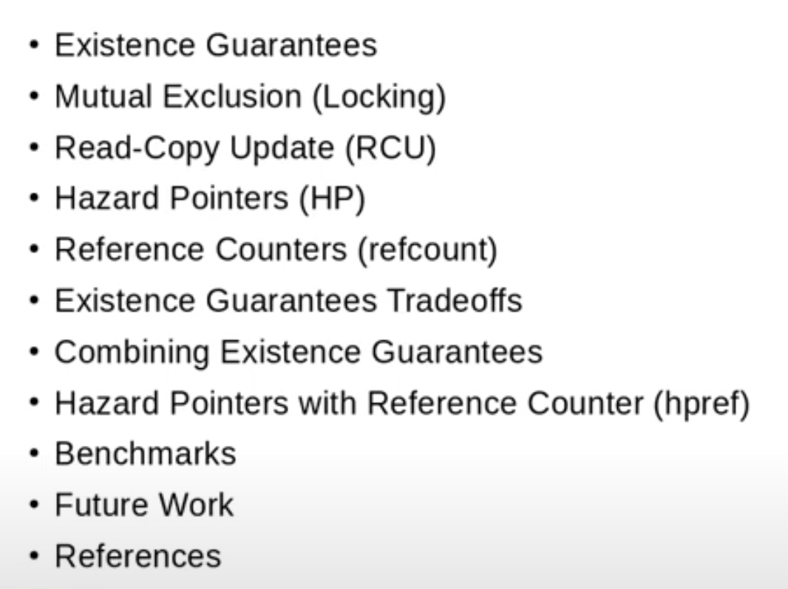

---

---
### Existence Guarantees
* **Definition**: When holding a pointer, one is guaranteed that accessing the object will not cause a segmentation fault; the memory exists.
* *Mechanisms*:
    * Immutable data (exists for system lifetime).
    * Mutual exclusion (temporarily provides guarantee, has overhead).
    * Read-Copy-Update (RCU).
    * Hazard Pointers.
    * Reference Counters.

---
### Mutual Exclusion (Locking)
* *Mechanisms (not exhaustive)*:
    * Spin locks
    * Mutexes
    * Reader-writer locks
    * Sequence lock (readers retry if object concurrently modified).

---
### RCU (Read-Copy-Update) Background
* RCU is relevant as the talk mixes RCU concepts with Hazard Pointers and reference counting.
* *Guarantees*:
    * **Publication Guarantee**: Ensures stores to an object are observed before a pointer to that object is observed by readers.
    * **Grace Period Guarantee (Reclaim)**:
        * Ensures all readers pass through a quiescent state between unpublishing a pointer and reclaiming the object.
        * Achieved by waiting for all pre-existing read-side critical sections to end before allowing reclaim.

---
### Hazard Pointers
* **Publication**: Similar to RCU.
* **Usage Tracking**: Differs from RCU by tracking the usage of *specific pointers* by readers through **Hazard pointer slots**, rather than tracking entire read-side critical sections.
* **Reclaim Process (High-Level View)**:
    1.  Store a null pointer to nullify the object pointer.
    2.  Issue a memory barrier.
    3.  Check every Hazard pointer slot for the address of the object to be reclaimed (using a load-acquire).
    4.  If the pointer is found in any slot, wait (stop progress) until it's no longer observed there.
    5.  Reclaim the object's memory.
* **Reader Side Process**:
    1.  Dereference the pointer, loading the object's address.
    2.  Store this address into a Hazard pointer slot.
    3.  Issue a memory barrier.
    4.  Dereference the same pointer to the object again and validate that the address has not changed.
        * If changed, retry.
        * If not changed, the object is stable and can be used.
    5.  When done, clear the Hazard pointer slot (with a store-release).
* **Core Guarantee**: The process forms a **Decker-like memory barrier guarantee**.
    * *Reclaim side*: Store to pointer (null) -> Barrier -> Load from Hazard pointer slots.
    * *Reader side*: Store to Hazard pointer slot -> Barrier -> Load from object pointer.

---
### Reference Counters
* **Function**: Counts the number of references to an object.
* **Initialization**: Typically initialized to 1 upon object creation.
* **Operation**: Incremented for additional references, decremented when references are released.
* **Reclaim**: A release callback is invoked to reclaim memory when the count decrements to zero.

---
### Tradeoffs of Existence Guarantee Mechanisms

* **RCU**:
    * *Pros*:
        * Readers are very fast and scale well.
    * *Cons*:
        * Long read-side critical sections can postpone reclaim significantly, leading to high memory footprint.
        * Read-side critical sections prevent reclaim of *all* linked list nodes encountered during an entire reader traversal until the traversal is complete.
* **Hazard Pointers**:
    * *Pros*:
        * Readers are very fast and scale well.
        * Memory reclaim can occur *immediately* after a reader stops using the Hazard pointer address (major difference from RCU).
        * Good fit for "immortal pointers" (where the pointer itself is guaranteed to exist).
    * *Cons*:
        * Immediate reclaim of successor elements (e.g., in a linked list) can cause issues for data structure traversals if elements are concurrently removed and reclaimed.
            * Hazard Pointers protect *node-per-node*, not the entire traversal path like RCU.
        * *Workaround Strategies*:
            * Maged Michael (2004): Put a null pointer in the `next` value of a removed node to stop readers.
            * Conventionally prevent reclaim by putting a Hazard Pointer on the list head (downside: can lead to unbounded memory use for large lists, similar to RCU issues).
        * Not a good fit if elements are chained within multiple data structures.
* **Reference Counting**:
    * *Pros*:
        * Memory efficient (reclaim happens immediately when count reaches zero).
    * *Cons*:
        * Frequent incrementing/decrementing on heavily used ref counts for short periods can cause significant cache line traffic and poor performance.
        * Cannot simply dereference a pointer and expect the ref count to guarantee existence, as the ref count field is *within* the object.
        * Requires another strategy (e.g., RCU, locking) to safely access the object initially to increment its ref count.

---
### Combining Mechanisms: HP ref (Hazard Pointers with Reference Counter)
* **Idea Genesis**: Based on experience combining RCU with ref counts (iterate with RCU, find node, increment ref count, then RCU critical section can end). Apply this to Hazard Pointers.
* **Concept**: Use Hazard Pointers to grab an object and guarantee its existence, then increment a ref count in it.
    * Update side needs to synchronize both Hazard Pointers and decrement the ref count.
* **HP ref Prototype**:
    * Implemented in user space.
    * Based on user-space RCU library and `librseq` (for per-CPU data allocation).
    * **Reader Fastpath**: Uses Hazard Pointers.
    * **Fallback**: Falls back to ref count if no Hazard Pointer slots are available.
    * **Memory**: Bounded – 8 slots per CPU, a single cache line per CPU.
    * **Simplicity**:
        * No dynamic allocation of slots.
        * No B-tree ordering of slots by address.
        * Around 200 lines of code; compact and fast.
    * **Promotion**: Readers can *promote* their Hazard Pointer to a ref count if they intend to keep the reference for a long time.
    * **Emergency Slot**: The last slot is an emergency slot, used by the API to try to grab a Hazard Pointer reference and transform it to a ref count, ensuring it's always available.

---
### HP ref: API and Synchronization
* **Synchronization Mechanisms**:
    1.  Wait for a *specific* Hazard Pointer value to be unused (for single value reclaim).
    2.  **Batch Reclaim**: `hp_ref_synchronize` - synchronizes against *all* previously held Hazard Pointers (similar to a `call_rcu` worker thread).
        * *How it works*: Waits for all prior Hazard Pointer slots (fixed number system-wide: slots * num_CPU) to pass through a **quiescent state** (where they are null).
        * Once all slots have been observed as null during `synchronize`, it guarantees no previously held Hazard Pointers are still present after this "grace period".
* **Detecting Quiescent State for a Slot**:
    * The slot is observed to be `null`.
    * A transition is observed in the slot (value changes from `ptr_A` to `ptr_B`), implying it must have passed through `null` in between.
* **Forward Progress Guarantee for `synchronize`**:
    * *Problem*: A steady stream of readers reusing the same slot for the same value could theoretically block `synchronize`.
    * *Solution*: A **two-phase algorithm** (current period/phase).
        * `synchronize` waits for the *other* phase parity.
        * Readers load the current phase value and tag the lowest bit of their Hazard Pointer address with this phase.
        * This ensures `synchronize` is not blocked by newly arriving readers in the current phase. (Trick used in user-space RCU).

---
### Benchmarks
* *(Note: Order of magnitude matters more than exact numbers; benchmarks run on a laptop)*.
* *Test*: Number of reads in 10 seconds; short critical section (dereference pointer, check content). Updater swaps published value, allocates new memory, reclaims old.
* **Results (Read-Side Speed, higher is better)**:
    * `qsbr` (no explicit lock/unlock code on read side): Highest performance.
    * `urcu` and `urcu_bp` (RCU lock/unlock, uses `membarrier` syscall + compiler barriers to eliminate barriers from read fastpath): ~50% speed of `qsbr`.
    * **HP ref** (with `membarrier` + compiler barrier): ~25% slower than `urcu`. Considered "pretty nice."
    * HP ref (with explicit barrier): Factor of 8 slower than HP ref with `membarrier` optimization.
        * *Conclusion*: Most cost comes from the barrier.
    * Per-thread locking, mutexes, reader-writer locks: Much slower.
* **Kernel Implication**: Consider a hybrid solution for kernel space, using IPIs to remove barriers from the read-side fastpath, paired with an IPI from the scan for synchronizing.

---
### Future Work
1.  **Port User-Space Prototype to Linux Kernel**:
    * Expected to be a one-to-one mapping of APIs.
    * Kernel luxury: Can disable preemption (user space needs restartable sequences like `RSEQ` to compare and set slots atomically).
2.  **Apply to Speed Up Heavy Users of Reference Counts**:
    * Discussed with Greg K-H.
    * Potential use cases: Replacing locking used in driver code to guarantee object existence before taking a reference count.
3.  **Scheduler-Assisted Promotion (More Complex)**:
    * Instead of explicit reader promotion, let the scheduler promote a Hazard Pointer to a ref count when it preempts a reader in the kernel. (Tricky in user space).
4.  **Scanner-Initiated Promotion (Even More Complex)**:
    * Rather than waiting for Hazard Pointers to be cleared, if a scan is waiting, it could "poke" the reader's state, change its Hazard Pointer ownership to a ref count (with proper sync).
    * This would provide very hard forward progress guarantees for `synchronize_hp_ref`.
5.  **Application to Concurrent Data Structure Traversal (e.g., HP-friendly Linked List)**:
    * *Goal*: Create a Hazard Pointer friendly linked list.
    * **Proposed Idea (with a hand-drawn diagram)**:
        * Use **two linked lists**: one for readers, one for writers (nodes are chained twice).
        * **Removal Operation (`hide_from_readers`)**:
            * Example: Removing node B (between A and C).
            * Make A and C point to each other in the *reader list*, bypassing B.
            * Crucially, *keep reader pointers from B intact* so a reader on B can still progress to C.
        * **Handling Cascading Hides**:
            * If C also gets hidden from readers, a reader on B might point to a soon-to-be-reclaimed C.
            * *Solution*: When C is hidden, use the *writer list* (which still links to B) to walk backwards and find all nodes (like B) whose reader-list `next` pointer needs updating to skip C and point to C's successor.
        * This ensures all reader-list `next` pointers point to valid, live nodes observable by readers.
        * After updating, perform Hazard Pointer synchronization *before* actually removing B and C from the writer list and freeing them.
    * The speaker believes this two-list approach should support linked list traversals protected by Hazard Pointers but admits it needs testing and might have flaws.

---
### References
* Maged Michael's work on Hazard Pointers (2004).
* Link to the speaker's prototype on LKML.

---
### Q&A Session
* **Question 1**: If the scheduler converts Hazard Pointer to reference count, could it create overhead if the conversion wasn't strictly necessary?
    * **Answer (Mato)**: Yes, it might not help in all cases. This is why he prefers the *other* scheme: when a *specific* Hazard Pointer is blocking forward progress, the scan/synchronizer part would be responsible for converting *that one* to a ref count. Adding ref count logic to the scheduler could be complex and add overhead; this is a concern.
* No other questions.