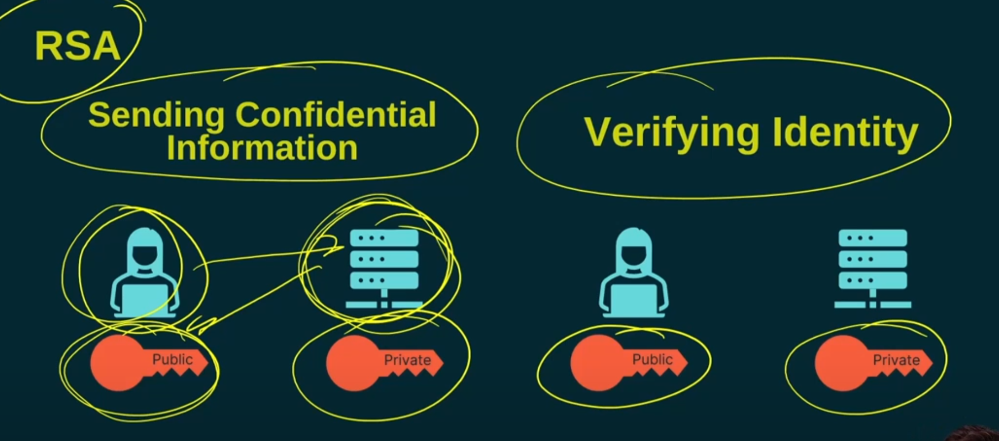
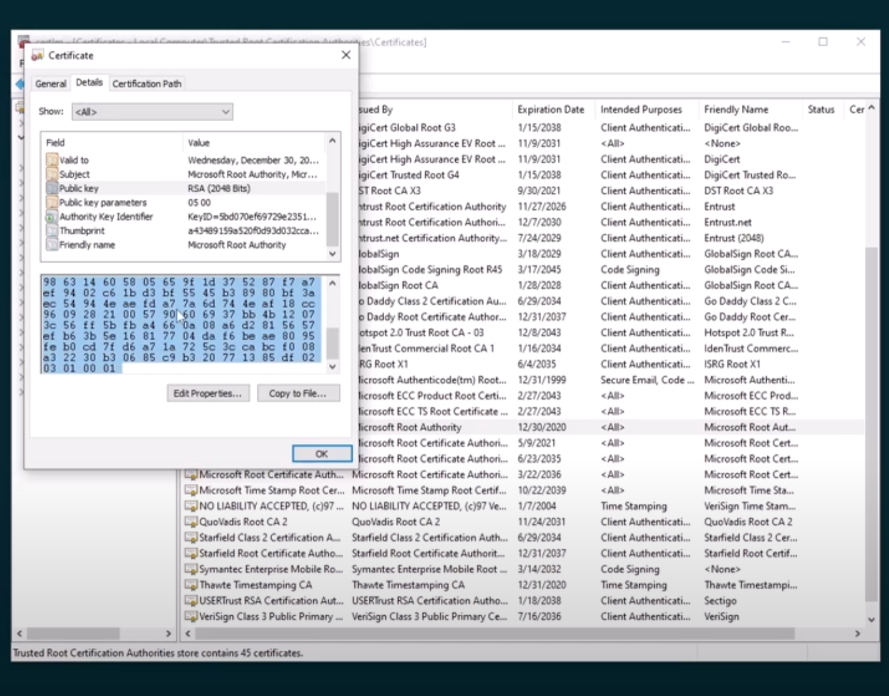
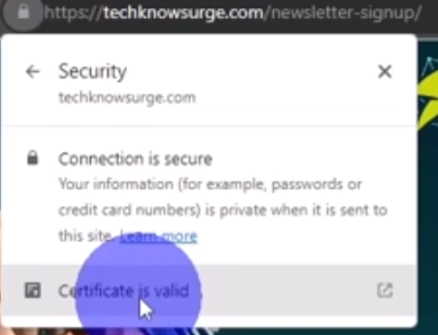

# Public Key Infrastructure and Digital Certificates Breakdown

## **Overview**
- Topic: Public Key Infrastructure (PKI) and Digital Certificates.
- Focus: Scratch the surface to understand PKI, digital certificates, their purpose, and usage.

---

## **Topics Covered**
1. **Quick Review of RSA**
2. **Digital Certificates**
3. **Third-Party Trust**
4. **Public Key Infrastructure**

---

## **RSA Encryption Cipher**
- **Type**: Asymmetric Keys.
- **Key Mechanism**:
  - Encryption key ≠ Decryption key.
  - A private key and a public key are used.
  
### **Use Cases**:
1. **Confidential Information**:
   - **Process**:
     - Web server provides its public key.
     - User encrypts shared key using the public key.
     - The encrypted data is sent across the network.
     - Web server decrypts using its private key.
   - **Benefit**: Ensures encrypted data cannot be intercepted by others.
   
2. **Identity Verification**:
   - **Process**:
     - Web server encrypts data with its private key.
     - User decrypts data using the server's public key.
   - **Purpose**: Confirms association between private and public keys, aiding in identity verification.

---

## **Digital Certificates**
- **Definition**: Contains the public key and additional information.
- **Extra Information**:
  - Expiration date of the certificate (not the public key itself).
  - Public key embedded within the certificate.
  
### **Viewing Digital Certificates on Windows**:

1. **Access**:
   - Click "Windows" button and search for "Manage Computer Certificates".
   - Navigate through certificate management console.
2. **Example**:
   - Open "Trusted Root Certificate Authority".
   - View a certificate (e.g., Microsoft certificate with expiration details, version, and public key in HEX format).

---

## **Limitations of Digital Certificates**
- **Issue**:
  - Anyone can generate a public/private key pair and create certificates.
  - Alone, certificates do not verify the server's authenticity.
- **Solution**:
  - Use a **trusted third party**, known as a Certificate Authority (CA).
  - CA validates the certificate, ensuring authenticity.

---

## **Public Key Infrastructure (PKI)**
- **Definition**: A broader framework including public key cryptography and trusted third parties.
- **Components**:
  - **Public Key Cryptography**: Uses private/public keys for encryption and identity verification.
  - **Trusted Third Party**: Validates digital certificates (e.g., Certificate Authority).

---

## **Real-World Example**

- **Scenario**:
  - Accessing a website using HTTPS (e.g., technosurge.com).
  - HTTPS ensures encryption and authenticity through certificates.
  
### **Steps**:
1. **Encrypted Page**:
   - HTTPS indicates the page was downloaded securely.
   - Certificate Authority validated the certificate.
2. **Inspecting the Certificate**:
   - Click on the lock icon → "Connection is secure" → "Certificate is valid".
   - View public key and CA issuer details.

---

## **Key Takeaways**
- **RSA**:
  - Provides encryption and identity verification through private/public keys.
- **Digital Certificates**:
  - Include public keys and other metadata but require validation for authenticity.
- **PKI**:
  - Incorporates public key cryptography and trusted third parties for secure communication.