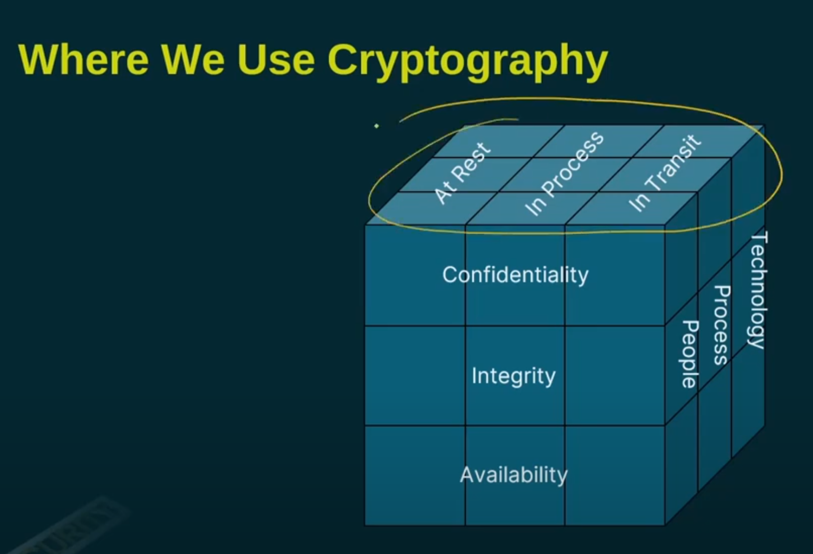
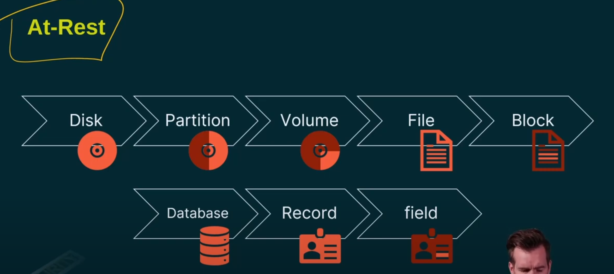

#### **Introduction to Encryption**
- **Purpose**: Keeps things confidential.
- **Trade-off**: Consumes processing power.
- **Trends**: 
  - Previously, encryption was selective.
  - Now, encryption is widely adopted due to its importance for companies and cybersecurity.

---

#### **Types of Encryption**
1. **Encryption at Rest**
   - **Definition**: Protects data stored somewhere.
   - **Levels of Encryption**:
     - **Disk Level**: Entire disk is encrypted, inaccessible without the key.
     - **Partition Level**:
       - Disks consist of partitions.
       - Encrypting individual partitions or multiple partitions is an option.
     - **Volume Level**:
       - Partitions can be broken into volumes.
       - Example: *BitLocker* (Microsoft's tool for volume-level encryption).
     - **File Level**:
       - Encrypt specific files on the disk.
       - Option to encrypt blocks within files.
   - **Database Encryption**:
     - Encrypt the whole database.
     - Encrypt specific records, fields, or tables.

2. **Encryption in Process**
   - **Definition**: Protects data during processing.
   - **Scenarios**:
     - Encrypt data immediately upon entry.
     - Encrypt data being processed on a processor.
   - **Challenges**:
     - Requires decryption for processing.
     - High CPU load.
     - Complex implementation.

3. **Encryption in Transit**
   - **Definition**: Protects data while it is transferred across networks.
   - **Common Method**:
     - **TLS (Transport Layer Security)**:
       - Modern standard for secure data transfer.
       - Replaced **SSL (Secure Sockets Layer)**, which is now considered insecure.

---

#### **Considerations for Encryption**
- **Performance Impact**:
  - Encryption and decryption require significant processing power.
  - Rolling out encryption universally may result in performance hits.
- **Balancing Act**:
  - Striking a balance between performance and security is crucial.
  - Decisions depend on the level of encryption required for specific scenarios.

