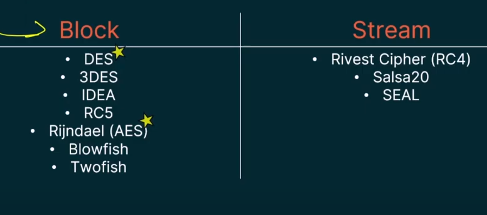

#### **1\. Symmetric Encryption Overview**

-   Uses the **same key** for encryption and decryption.

-   Primarily used for **bulk data encryption** (efficient & fast).

#### **2\. Block Ciphers vs. Stream Ciphers**

| **Feature** | **Block Cipher** | **Stream Cipher** |
| --- |  --- |  --- |
| **Processing** | Encrypts data in **fixed-size chunks** (blocks). | Encrypts data **bit-by-bit or byte-by-byte** (on-the-fly). |
| --- |  --- |  --- |
| **Common Use Cases** | Files, databases, large data transfers. | Real-time data (e.g., streaming video, network comms). |
| **Memory Usage** | Higher (processes larger blocks). | Lower (processes smaller units). |
| **Padding** | May require padding to fill block size. | No padding needed. |
| **Examples** | AES, DES, Blowfish, Twofish. | RC4, ChaCha20. |

#### **3\. Block Ciphers in Detail**

-   **Block Size**:

    -   Fixed (e.g., **64-bit** in DES, **128-bit** in AES).

    -   If data < block size, **padding** is added.

-   **Advantages**:

    -   Easier to implement.

    -   Supports **integrity/authentication** (e.g., AES-GCM).

-   **Disadvantages**:

    -   Slower for real-time streaming.

#### **4\. Stream Ciphers in Detail**

-   **Processing**:

    -   Encrypts **one bit/byte at a time**.

    -   Ideal for **continuous data streams** (e.g., VoIP, live video).

-   **Advantages**:

    -   Low latency, minimal memory usage.

    -   No padding required.

-   **Disadvantages**:

    -   Less common than block ciphers.

    -   Vulnerable if key reuse occurs.

#### **5\. Key Algorithms**

##### **Block Ciphers**

-   **DES (Data Encryption Standard)**

    -   **56-bit key**, **64-bit block size**.

    -   Cracked in 1997 → **deprecated**.

-   **Triple DES (3DES)**

    -   **168-bit key** (or **112-bit** with key reuse).

    -   Applies DES **three times** (encrypt → decrypt → encrypt).

    -   Now considered **insecure** for modern use.

-   **AES (Advanced Encryption Standard)**

    -   **Block size**: 128 bits.

    -   **Key sizes**: 128, 192, or 256 bits.

    -   **Rounds**:

        -   10 rounds (128-bit key).

        -   12 rounds (192-bit key).

        -   14 rounds (256-bit key).

    -   **Transformation rounds**: Each round scrambles data further.

##### **Stream Ciphers**

-   **RC4** (deprecated due to vulnerabilities).

-   **ChaCha20** (modern alternative, used in TLS).

#### **6\. Key Takeaways**

-   **Block ciphers** dominate for **stored data** (files, databases).

-   **Stream ciphers** excel in **real-time communication**.

-   **AES** is the **current standard** for symmetric encryption.

-   **DES/3DES** are **obsolete** due to security flaws.