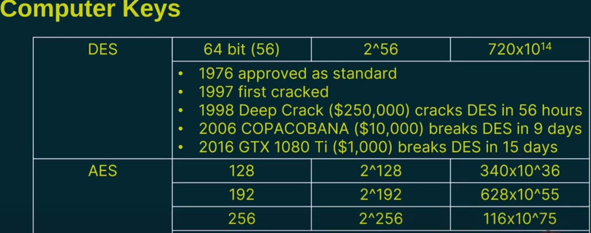

### **Cryptographic Keys & Key Length**  

#### **Requirements for Encryption**  
To create **cipher text**, you need:  
1. **Plain text** (original message).  
2. **Cipher/algorithm** (encryption method).  
3. **Key** (additional data for encryption/decryption).  

#### **Key Length & Security**  
- **Longer keys = More secure encryption**.  
- Example:  
  - **Key = 8** (shift alphabet by 8 places).  
    - *Plain text*: **"secret"** → *Cipher text*: **"amkzmb"**.  
  - **Weakness**: Repeating letters (e.g., **"m"** likely **"e"**) make it easy to crack.  

#### **Increasing Security with Longer Keys**  
- **Multi-table substitution**:  
  - **Key = 8, 2** (alternating shifts).  
    - *Plain text*: **"secret"** → *Cipher text*: **"agktmz"**.  
      - First **"e"** → **"g"**, second **"e"** → **"m"** (no repetition).  
  - **Key = 8, 2, 5** (three alternating shifts).  
    - Further increases complexity.  

#### **Computer Keys (Binary Bits)**  
- **Bits** (binary digits: **0 or 1**) determine key strength.  
- **Each added bit doubles complexity**:  
  - **1 bit** = 2 possibilities (**0, 1**).  
  - **2 bits** = 4 possibilities (**00, 01, 10, 11**).  
  - **8 bits** = 256 possibilities (**2⁸**).  
  - **Formula**: **2ⁿ** (where **n** = number of bits).  

#### **Historical Encryption Standards**  
| **Standard** | **Key Length** | **Possibilities** | **First Cracked** |  
|--------------|---------------|-------------------|-------------------|  
| **DES** (1976) | **56-bit** | ~72 quadrillion | 1997 |  
| **AES** (2001) | **128/192/256-bit** | ~3.4×10³⁸ (128-bit) | Unbroken (as of now) |  

- **Why not always use 256-bit?**  
  - **Trade-offs**: Processing power, energy, delay.  
  - **128-bit** often sufficient for most applications.  

#### **Unbreakable Encryption: One-Time Pad**  
- **Rules for uncrackable encryption**:  
  1. **Key length ≥ plain text length**.  
  2. **Key must be truly random** (uniform distribution).  
  3. **Never reuse the key**.  
  4. **Key must remain secret**.  
- **Theoretically secure**, but impractical for most uses.  

#### **Key Takeaways**  
- **Key length directly impacts security**.  
- **Modern standards (AES) use 128+/bit keys**.  
- **One-time pads are unbreakable but impractical**.  
- **Balance security with computational cost**.