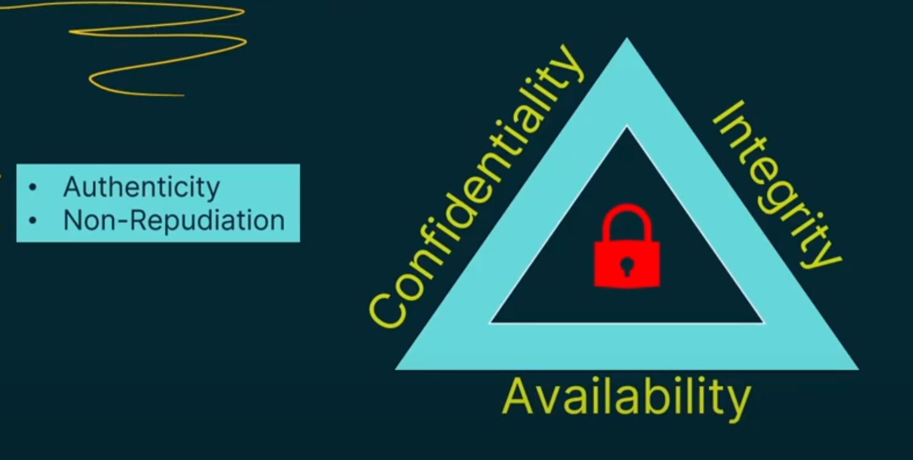
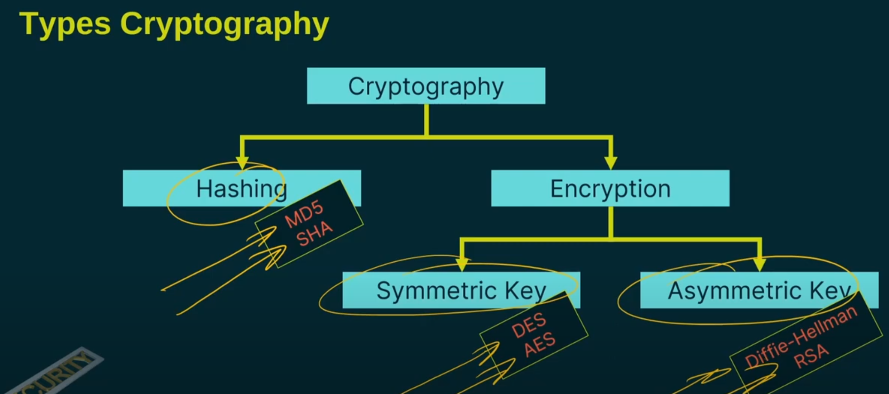

### **Modern Cryptography Breakdown**  

#### **Why We Need Cryptography**  
- **CIA Triad** (Core Security Principles):  
  - **Confidentiality**:  
    - Encryption ensures data is hidden from unauthorized access.  
  - **Integrity**:  
    - Cryptographic hashing verifies data hasn’t been altered.  
  - **Availability**:  
    - Securing systems (e.g., password protection) prevents attacks that disrupt access.  

- **Additional Security Pillars**:  
  - **Authenticity**:  
    - Verifies the sender’s identity (e.g., digital signatures).  
  - **Non-repudiation**:  
    - Prevents senders/receivers from denying involvement (e.g., audit trails).  

#### **Cryptography Basics**  
- **Algorithm**:  
  - A **step-by-step process** that transforms plain text → cipher text (e.g., Caesar Cipher).  
  - Solves specific problems (e.g., encryption, hashing).  
- **Protocol**:  
  - **Standardized rules** for secure communication (e.g., HTTPS, IPsec).  
  - Defines:  
    - Data formats.  
    - Connection methods.  
    - Encryption algorithms used within the protocol.  

#### **Types of Cryptography**  

1. **Hashing**:  
   - Creates a **fixed-size fingerprint** (hash) of data.  
   - **Irreversible** (cannot decrypt hashes).  
   - **Examples**:  
     - **MD5** (deprecated due to vulnerabilities).  
     - **SHA** (Secure Hash Algorithm).  

2. **Encryption**:  
   - **Symmetric Key Encryption**:  
     - **Single shared key** for encryption/decryption.  
     - **Faster**, but key distribution is a challenge.  
     - **Subtypes**:  
       - **Stream Cipher** (encrypts data bit-by-bit).  
       - **Block Cipher** (encrypts fixed-size blocks, e.g., AES).  
     - **Examples**:  
       - **DES** (56-bit, outdated).  
       - **AES** (128/192/256-bit, modern standard).  

   - **Asymmetric Key Encryption**:  
     - Uses **public/private key pairs**.  
     - **Slower**, but solves key distribution issues.  
     - **Examples**:  
       - **Diffie-Hellman** (secure key exchange).  
       - **RSA** (encryption & digital signatures).  

#### **Key Takeaways**  
- Cryptography supports **CIA Triad + Authenticity/Non-repudiation**.  
- **Algorithms** are computational processes; **protocols** govern secure communication.  
- **Hashing** (irreversible) vs. **Encryption** (reversible).  
- **Symmetric** (fast, single key) vs. **Asymmetric** (secure, key pairs).  

*(No conclusion or summary added as requested.)*