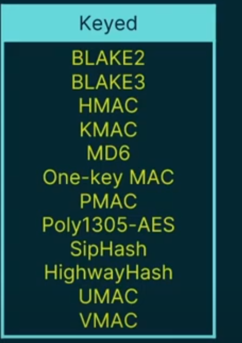

### **Hashing Algorithms Breakdown**  

#### **What is a Hash?**  
- A hash is like a **fingerprint** that uniquely identifies data (e.g., files, passwords).  
- It is generated by a **hashing algorithm** (represented as a funnel/blender).  
  - Input: User ID, transaction number, date of birth, etc.  
  - Output: A fixed-length string (the "fingerprint").  

#### **Characteristics of a Secure Hash**  
- **Fixed Length**: Output remains the same size regardless of input size.  
- **One-Way Function**: Cannot reverse-engineer the original data from the hash.  
- **Avalanche Effect**: A small change in input drastically changes the output.  
- **Uniqueness**: Ideally, each input produces a unique hash (though **hash collisions** can occur).  
  - *Hash Collision*: Two different inputs produce the same hash (undesirable but sometimes unavoidable).  

#### **Use Cases for Hashing**  
1. **Password Storage**  
   - Instead of storing plaintext passwords, systems store hashes.  
   - Process:  
     - User enters password → hashed → stored in database.  
     - During login:  
       - Entered password is hashed again.  
       - System compares stored hash with new hash → grants access if they match.  
   - Benefits:  
     - Prevents exposure if database is breached.  
     - Admins cannot see actual passwords.  

2. **File Integrity Verification**  
   - Ensures downloaded files are unaltered.  
   - Process:  
     - File is hashed (e.g., using SHA).  
     - Generated hash is compared to a **known good hash**.  
     - If they match, the file is authentic.  
   - Protects against **man-in-the-middle attacks** (e.g., tampered files).  

#### **Common Hashing Algorithms**  
- **MD5**  
  - Previously popular but **now insecure** (prone to collisions).  
- **SHA (Secure Hash Algorithm)**  
  - Widely used (e.g., SHA-256).  
  - Preferred for security applications.  
- **CRC (Cyclic Redundancy Check)**  
  - Used for error detection (not cryptographic hashing).  

#### **Key Takeaways**  
- Hashes ensure **integrity, authenticity, and non-repudiation**.  
- Secure hashing requires **fixed length, one-way function, and avalanche effect**.  
- **SHA** is currently the most reliable for cryptographic purposes.