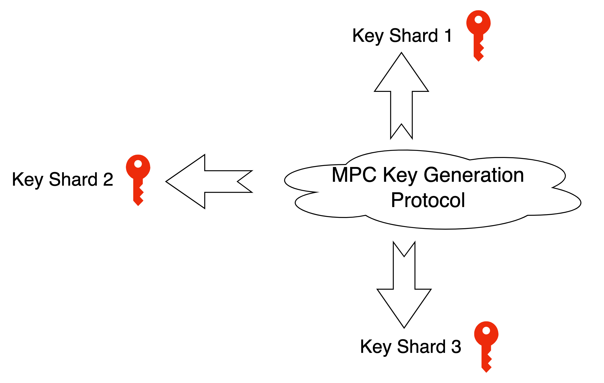
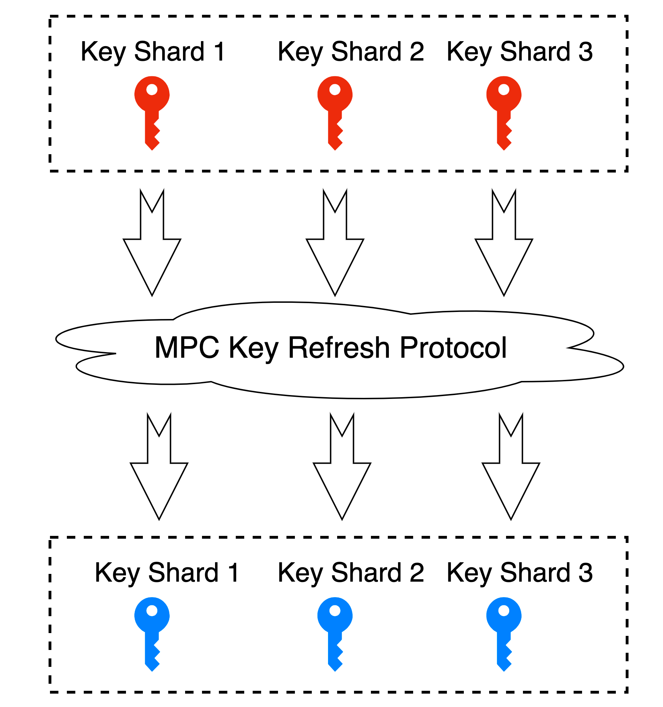
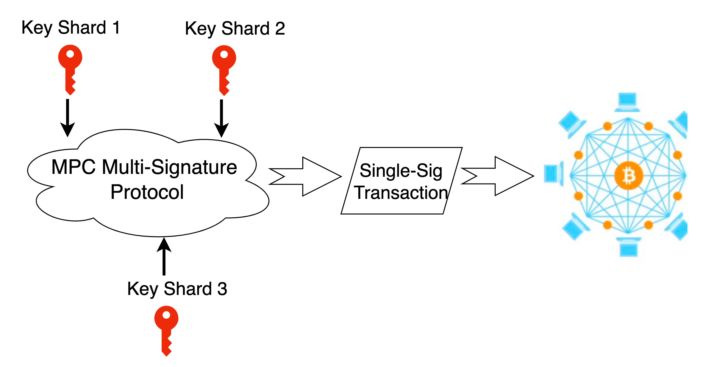

In 1982, [Andrew Chi-Chin Yao](https://en.wikipedia.org/wiki/Andrew_Yao), Turing Award winner, introduced a very important concept --- Secure Multi-Party Computation in his paper. To vividly explain this concept, he proposed the famous "Millionaire Problem".

Two millionaires bumped into each other and they are interested in knowing who of them is richer but not revealing their actual wealth.

What is Secure Multi-Party Computation
--------------------------------------

Secure Multi-Party Computation focuses on how to securely compute a consensual function without any trusted third parties. Secure Multi-Party Computation has been the cryptographic foundation for e-voting, threshold signature, online auctions, etc. Secure Multi-Party Computation in short is generally called **SMPC** or **MPC**.

### **Types of Technologies Involved in Secure Multi-Party Computation**

There are many technologies involved in MPC, such as Garbled Circuit came up with Yao, Oblivious Transfer, Zero Knowledge Proof, Homomorphic Encryption, and more. We will gradually give introductions to those technologies in our Blog.

----
Key Features of Secure Multi-Party Computation
----------------------------------------------

### Input Privacy

MPC studies how to protect the private data of each party during participants' collaborative computing, focusing on the privacy and security issues between the parties. In the process of Secure Multi-Party Computation, it is necessary to ensure that each party's private input is independent and no local data is leaked during computing.

### Computing Accuracy

Multiple computing participants perform the collaborated computing for a certain consensual computing task via the agreed MPC protocol. After all the computing is completed, each party gets the correct data feedback.

### Decentralization

Traditional distributed computing is to have the central node coordinate each user's computing progress, collecting each user's input. But MPC provides a decentralized computing scheme in which all participants are equal without privileged parties or third parties.

----

Secure Multi-Party Computation Scenarios in Multisignature
----------------------------------------------------------

### Distributed Key Shard Generation

In the traditional generation of keys, a public-private key pair is generated and the public key is shown to the public as the asset account while the private key is managed by privileged people. Distributed key shard generation is completely different from the traditional way. The key itself is no longer to be generated locally by a single person. Instead, all participants execute an MPC key generation protocol in accordance with the t-of-n threshold. When the protocol ends, everyone can get the respective private key shard and a shared public key. This public key is the asset account but the corresponding private key never appears. Thus, the assets under the public key are co-managed by all parties. When the key sharding completes, everyone can hold one key shard. That's to say, in order to get the original real private key, the attacker has to obtain all the key shards (no less than the threshold) to recover the real original private key.

### Distributed Key Refreshing

To enhance security, a key refreshing protocol will be executed once in a while and a set of key shards will be refreshed. Once the refreshing protocol is executed, everyone will get a new key shard and the old one will be invalid.

### Distributed Key Shard Signing

To obtain a valid signature and thus create a valid single-signature transaction, the MPC Multisignature Protocol must be executed jointly by a threshold number of participants (a quorum). When the protocol is jointly executed, all will get the same valid signature. No key shard will be exposed during the whole execution.

Common MPC Multisig Protocol
----------------------------

In MPC Multisig, we need to implement various MPC protocols in accordance with different user scenarios, including but not limited to:

-   MPC-ECDSA Protocol
-   MPC-EdDSA Protocol
-   MPC-BLS Protocol
-   MPC-Schnorr Protocol
-   MPC-HMAC Protocol

The first protocol to introduce is the MPC-ECDSA Protocol. As most blockchains adopt the ECDSA, based on the elliptic curve Secp256k1, as their signature algorithm, so MPC-ECDSA Protocol catches the most attention among all MPC protocols. The implementation difficulty of the ECDSA multi-party protocol is obviously higher than other signatures. Thus, it takes a very long time for MPC-ECDSA Protocol implementation.

The quickest protocol to get a breakthrough is the Two-Party ECDSA Protocol. Lindell proposed one pretty good two-party MPC protocol (refer to [Fast Secure Two-Party ECDSA Signing](https://eprint.iacr.org/2017/552)) and one typical implementation of which is ZenGo's Keyless wallet. Another implementation of the Two-Party MPC-ECDSA Protocol is to apply the Garbled Circuit introduced by Andrew Chi-Chin Yao and [Unbound Security has implemented the solution based on this](https://github.com/unboundsecurity/blockchain-crypto-mpc).

From the above, we see progress on the MPC-ECDSA Protocol in the field of common threshold signature. Critical contributors include Gennaro and Goldfeder, Lindell, Doerner and Canetti.
With the above people's contribution, companies with cryptography competence started to implement their own algorithms. A new era begins!

With more and more new blockchains and applications joining, people have more needs regarding MPC multisignature protocols, including but not limited to MPC-EdDSA Protocol, MPC-BLS Protocol and MPC-Schnorr Protocol. Compared to the ECDSA protocol, corresponding MPC protocols based on signature algorithms such as EdDSA, BLS and Schnorr can be a bit easier, however, we still need to be cautiously careful about implementation as a lot of security traps need to be avoided.

Besides, if managing assets over multiple platforms in one place, people need more protocols, such as MPC-HMAC Protocol. There are serious performance issues in the implementation of the MPC-HMAC Protocol which needs to be optimized several times.