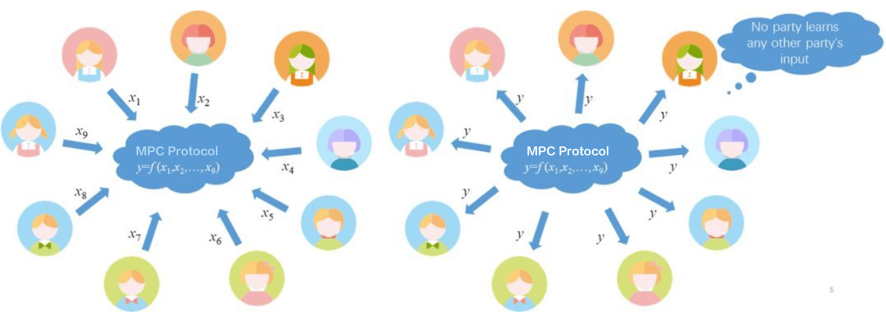

In 1982, [Andrew Chi-Chin Yao](https://en.wikipedia.org/wiki/Andrew_Yao), Turing Award winner, introduced a very important concept --- Secure Multi-Party Computation in his paper. To vividly explain this concept, he proposed the famous "Millionaire Problem".

Two millionaires bumped into each other and they are interested in knowing who of them is richer but not revealing their actual wealth.

What is Secure Multi-Party Computation
--------------------------------------

Secure Multi-Party Computation focuses on how to securely compute a consensual function without any trusted third parties. Secure Multi-Party Computation has been the cryptographic foundation for e-voting, threshold signature, online auctions, etc. Secure Multi-Party Computation in short is generally called **SMPC** or **MPC**.

### **Types of Technologies Involved in Secure Multi-Party Computation**

There are many technologies involved in MPC, such as Garbled Circuit came up with Yao, Oblivious Transfer, Zero Knowledge Proof, Homomorphic Encryption, and more. We will gradually give introductions to those technologies in our Blog.

----
Key Features of Secure Multi-Party Computation
----------------------------------------------

### Input Privacy

MPC studies how to protect the private data of each party during participants' collaborative computing, focusing on the privacy and security issues between the parties. In the process of Secure Multi-Party Computation, it is necessary to ensure that each party's private input is independent and no local data is leaked during computing.

### Computing Accuracy

Multiple computing participants perform the collaborated computing for a certain consensual computing task via the agreed MPC protocol. After all the computing is completed, each party gets the correct data feedback.

### Decentralization

Traditional distributed computing is to have the central node coordinate each user's computing progress, collecting each user's input. But MPC provides a decentralized computing scheme in which all participants are equal without privileged parties or third parties.

----

Secure Multi-Party Computation Scenarios in Multisignature
----------------------------------------------------------

### Distributed Key Shard Generation

In the traditional generation of keys, a public-private key pair is generated and the public key is shown to the public as the asset account while the private key is managed by privileged people. Distributed key shard generation is completely different from the traditional way. The key itself is no longer to be generated locally by a single person. Instead, all participants execute an MPC key generation protocol in accordance with the t-of-n threshold. When the protocol ends, everyone can get the respective private key shard and a shared public key. This public key is the asset account but the corresponding private key never appears. Thus, the assets under the public key are co-managed by all parties. When the key sharding completes, everyone can hold one key shard. That's to say, in order to get the original real private key, the attacker has to obtain all the key shards (no less than the threshold) to recover the real original private key.