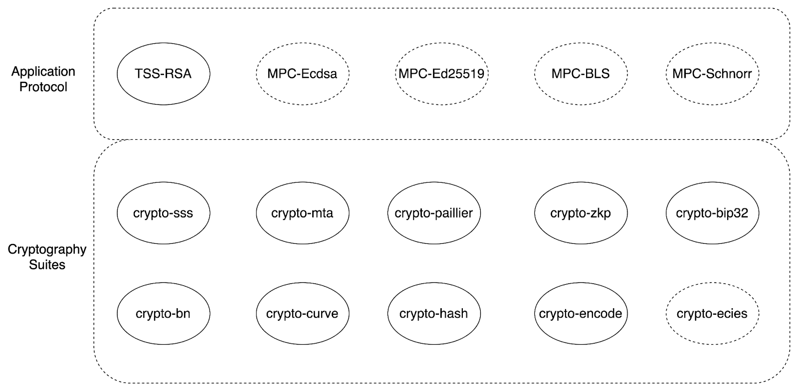

## MPC Protocol Comparison Table

| **Characteristic** | **MPC-ECDSA** | **MPC-EdDSA** | **MPC-BLS** | **MPC-Schnorr** | **MPC-HMAC** |
|---|---|---|---|---|---|
| **Signature Type** | Elliptic Curve DSA | Edwards-curve DSA | Boneh-Lynn-Shacham | Schnorr Signature | Hash-based MAC |
| **Curve Type** | Weierstrass curves (e.g., secp256k1) | Twisted Edwards curves (e.g., Ed25519) | Pairing-friendly curves (e.g., BLS12-381) | Any prime-order group | N/A (symmetric) |
| **Key Generation Complexity** | High - requires DKG with Paillier | Moderate - simpler DKG | Moderate - standard DKG | Low - simple DKG | Low - symmetric key sharing |
| **Signing Rounds** | 2-4 rounds typically | 2-3 rounds | 1-2 rounds | 2 rounds | 1 round |
| **Communication Complexity** | $O(n^2)$ per signature | $O(n^2)$ per signature | $O(n)$ to $O(n^2)$ | $O(n^2)$ per signature | $O(n)$ per operation |
| **Computational Overhead** | High - Paillier operations | Moderate | High - pairing operations | Low - field operations | Very Low - hash operations |
| **Threshold Support** | $(t,n)$ threshold | $(t,n)$ threshold | $(t,n)$ threshold | $(t,n)$ threshold | $(t,n)$ threshold |
| **Key/Signature Size** | 64 bytes (secp256k1) | 64 bytes | 48-96 bytes | 64 bytes | 32-64 bytes |
| **Verification Speed** | Moderate | Fast | Slow (pairings) | Very Fast | Very Fast |
| **Aggregation Support** | No | No | Yes - native | Partial | No |
| **Deterministic** | No (requires randomness) | Can be deterministic | Yes | Can be deterministic | Yes |
| **Post-Quantum Security** | No | No | No | No | Depends on hash |
| **Implementation Complexity** | Very High | Moderate | High | Low-Moderate | Low |
| **Common Use Cases** | Bitcoin, Ethereum | Cryptocurrencies, TLS | Blockchain consensus | Various blockchains | API auth, data integrity |
| **Key Refresh Support** | Complex | Moderate | Moderate | Simple | Simple |
| **Proactive Security** | Possible but complex | Possible | Possible | Possible | Easy |
| **Typical Latency** | 50-200ms | 30-100ms | 100-300ms | 20-80ms | 5-20ms |

## Detailed Protocol Analysis

### **1. MPC-ECDSA**
**Strengths:**
- Wide compatibility (Bitcoin, Ethereum)
- Well-studied security properties
- No changes needed to verifiers

**Weaknesses:**
- Complex implementation (requires Paillier encryption)
- High computational overhead
- Non-linear operations make MPC challenging
- Vulnerable to timing attacks if not careful

**Best For:** Legacy blockchain integration where ECDSA is required

### **2. MPC-EdDSA**
**Strengths:**
- Cleaner curve arithmetic than ECDSA
- Better side-channel resistance
- Simpler implementation than ECDSA
- Deterministic variant available

**Weaknesses:**
- Less widespread adoption than ECDSA
- Still requires multiple rounds
- Not quantum-resistant

**Best For:** New systems prioritizing security and simplicity

### **3. MPC-BLS**
**Strengths:**
- Native signature aggregation
- Short signatures
- Unique signatures (deterministic)
- Good for consensus protocols

**Weaknesses:**
- Expensive pairing operations
- Larger key sizes
- Slower verification
- Requires pairing-friendly curves

**Best For:** Blockchain consensus, aggregated signatures

### **4. MPC-Schnorr**
**Strengths:**
- Simple and efficient
- Linear operations (MPC-friendly)
- Fast verification
- Small signatures
- Supports aggregation

**Weaknesses:**
- Less widespread adoption historically
- Requires careful nonce generation
- Not quantum-resistant

**Best For:** New applications prioritizing efficiency

### **5. MPC-HMAC**
**Strengths:**
- Extremely fast
- Simple implementation
- Symmetric crypto (potentially quantum-resistant with right hash)
- Single round possible
- Low bandwidth

**Weaknesses:**
- Not a public-key signature
- Key distribution challenges
- No non-repudiation
- Limited to symmetric scenarios

**Best For:** API authentication, internal systems

## Recommendations by Use Case

| **Use Case** | **Recommended Protocol** | **Reasoning** |
|---|---|---|
| Bitcoin/Ethereum Custody | MPC-ECDSA | Required for compatibility |
| New Blockchain Project | MPC-Schnorr or MPC-EdDSA | Better efficiency and security |
| Consensus/Validators | MPC-BLS | Aggregation capabilities |
| High-Performance Auth | MPC-HMAC | Lowest latency |
| Cross-chain Bridges | MPC-ECDSA or MPC-EdDSA | Broad compatibility |
| Internal Services | MPC-HMAC or MPC-Schnorr | Efficiency |

## Security Considerations

1. **All protocols** require secure communication channels between parties
2. **Key generation** is critical - must use verified DKG protocols
3. **Threshold selection** affects security vs. availability tradeoff
4. **Side-channel protection** varies by protocol (EdDSA best, ECDSA most vulnerable)
5. **Proactive security** easier with simpler protocols (HMAC, Schnorr)

----

| **Protocol** 🔑 | **Underlying Scheme**                                                     | **MPC Use Case**                                                      | **Strengths** ✅                                                                                                                                                                       | **Weaknesses** ⚠️                                                                                                                              | **Common Applications** 💻                                                      |
| --------------- | ------------------------------------------------------------------------- | --------------------------------------------------------------------- | ------------------------------------------------------------------------------------------------------------------------------------------------------------------------------------- | ---------------------------------------------------------------------------------------------------------------------------------------------- | ------------------------------------------------------------------------------- |
| **MPC-ECDSA**   | Elliptic Curve Digital Signature Algorithm (e.g., secp256k1, NIST curves) | Threshold signing across parties without revealing private key shares | - Widely adopted in blockchain (Bitcoin, Ethereum)   - Strong ecosystem support   - Well-studied security proofs                                                                | - Expensive multiplications (mod inverse, scalar mult)   - Communication heavy   - More complex MPC protocols vs Schnorr                 | Custodial wallets, institutional crypto custody, exchanges                      |
| **MPC-EdDSA**   | Edwards-curve Digital Signature Algorithm (e.g., Ed25519)                 | Threshold EdDSA signing with MPC                                      | - Faster & simpler arithmetic (twisted Edwards curve)   - Deterministic signatures (no nonce failure risk)   - Stronger security margin than ECDSA                              | - Less adoption in blockchains compared to ECDSA   - Fewer optimized MPC protocols available                                                | Modern cryptographic libraries, Solana ecosystem, secure messaging              |
| **MPC-BLS**     | Boneh–Lynn–Shacham signatures (pairing-based cryptography)                | Threshold signing with short, aggregatable signatures                 | - Signatures are very short (≈32B)   - Supports **signature aggregation** (multi-sig compressed)   - Non-interactive aggregation                                                | - Relies on pairings (heavier computation)   - Weaker assumption model (bilinear maps)   - Fewer efficient MPC libraries                 | Ethereum 2.0 validators, threshold consensus, distributed randomness            |
| **MPC-Schnorr** | Schnorr signature over elliptic curves                                    | Threshold Schnorr signing using MPC                                   | - Algebraically simpler than ECDSA   - Efficient, low round complexity   - Naturally suited for MPC   - Provable security in standard model                                  | - Not as widely deployed as ECDSA (though Bitcoin Taproot uses it)   - Requires careful nonce management                                    | Bitcoin Taproot multisig, threshold wallets, distributed key control            |
| **MPC-HMAC**    | Hash-based Message Authentication Code                                    | Threshold computation of HMAC across parties                          | - Lightweight (only needs hash functions)   - No reliance on elliptic curves   - Resistant to quantum attacks (hash-based)   - Good for authentication instead of signatures | - Not a signature (requires shared secret)   - Provides *symmetric* authentication only   - Key distribution in MPC setup still critical | Secure authentication, MPC-based API key management, distributed authentication |

👉 This table highlights how **MPC-ECDSA & MPC-Schnorr** are blockchain-critical, **MPC-EdDSA** is rising in modern systems, **MPC-BLS** is great for aggregation in consensus, and **MPC-HMAC** fits symmetric authentication use cases.

----

# MPC Protocol Comparison Review

## Executive Summary
This review compares five major Multi-Party Computation (MPC) protocols used in threshold cryptography for digital signatures and authentication. Each protocol has distinct characteristics regarding implementation complexity, performance, security assumptions, and practical applications.

## Comparison Table

| **Protocol** | **Implementation Complexity** | **Performance** | **Security Features** | **Communication Rounds** | **Key Advantages** | **Main Challenges** | **Primary Use Cases** |
|--------------|------------------------------|------------------|----------------------|----------------------|-------------------|-------------------|---------------------|
| **MPC-ECDSA** | Very High | Moderate | High security, widely analyzed | 2-4 rounds | • Universal blockchain support • Extensive research backing • Mature implementations | • Complex cryptographic operations • Multiple vulnerability discoveries • Requires sophisticated primitives | Bitcoin, Ethereum, legacy blockchain systems |
| **MPC-EdDSA** | Low | High | Strong security, deterministic | 2-3 rounds | • Simple implementation • Efficient computation • Deterministic nonces • Fast signing | • Limited blockchain adoption • Newer than ECDSA | Modern blockchains, Ed25519-based systems |
| **MPC-BLS** | Moderate | Very High | Aggregate signatures | 1-2 rounds | • Signature aggregation • Constant size signatures • Efficient verification • Threshold-friendly | • Complex pairing operations • Limited deployment • Patent considerations | Proof-of-stake systems, aggregate signatures |
| **MPC-Schnorr** | Low-Moderate | High | Proven security, simple | 2-3 rounds | • Linear structure • MPC-friendly design • FROST optimization • Bitcoin Taproot ready | • Nonce synchronization issues • Replay attack vulnerabilities | Bitcoin Taproot, emerging blockchain protocols |
| **MPC-HMAC** | High | Low-Moderate | Authentication-focused | 3-4 rounds | • Message authentication • Cross-platform compatibility • Key derivation functions | • Serious performance issues • Complex optimization required • Limited research | Multi-platform authentication, key derivation |

## Detailed Protocol Analysis

### MPC-ECDSA Protocol
**Status:** Most mature but most complex
- **Technical Complexity:** Requires advanced cryptographic primitives including Paillier encryption, range proofs, and zero-knowledge proofs
- **Security History:** Multiple vulnerabilities discovered (AS20, Alpha-Rays, TSSHOCK, BitForge) affecting major implementations
- **Performance:** 2-4 communication rounds, computationally intensive operations
- **Adoption:** Essential for Bitcoin, Ethereum, and most existing blockchains

### MPC-EdDSA Protocol
**Status:** Efficient and secure alternative
- **Technical Simplicity:** Leverages deterministic nonce generation, avoiding randomness issues
- **Performance:** Fast signing operations, minimal communication overhead
- **Security:** Strong inherent security properties, fewer implementation pitfalls
- **Limitations:** Limited blockchain ecosystem support compared to ECDSA

### MPC-BLS Protocol
**Status:** Specialized for aggregation scenarios
- **Unique Features:** Enables signature aggregation with constant-size outputs
- **Performance:** Extremely efficient for batch operations and large-scale systems
- **Cryptographic Basis:** Relies on pairing-based cryptography, requiring specialized curves
- **Use Cases:** Ideal for proof-of-stake consensus and multi-signature applications

### MPC-Schnorr Protocol
**Status:** Emerging standard with strong properties
- **Technical Advantages:** Linear structure makes it naturally suited for threshold implementations
- **FROST Enhancement:** Reduces communication rounds and improves efficiency
- **Bitcoin Integration:** Native support in Bitcoin Taproot upgrade
- **Security Considerations:** Requires careful nonce management to prevent attacks

### MPC-HMAC Protocol
**Status:** Specialized authentication protocol
- **Primary Purpose:** Message authentication and key derivation rather than signing
- **Performance Issues:** Significant computational overhead requiring multiple optimization cycles
- **Cross-Platform:** Designed for managing assets across multiple platforms
- **Research Status:** Limited academic research compared to signature protocols

## Key Findings and Recommendations

### For Blockchain Applications:
1. **Legacy Compatibility:** Use MPC-ECDSA for Bitcoin/Ethereum compatibility despite complexity
2. **Modern Systems:** Consider MPC-EdDSA or MPC-Schnorr for new implementations
3. **Aggregation Needs:** Implement MPC-BLS for systems requiring signature aggregation

### For Security-Critical Applications:
1. **Conservative Choice:** MPC-EdDSA offers best security-to-complexity ratio
2. **Proven Security:** MPC-Schnorr with FROST provides excellent security properties
3. **Avoid:** Complex MPC-ECDSA implementations unless absolutely necessary

### Performance Considerations:
1. **Fastest Signing:** MPC-EdDSA and optimized MPC-Schnorr
2. **Batch Operations:** MPC-BLS for aggregate scenarios
3. **Communication Efficiency:** FROST protocol minimizes network rounds

## Conclusion
The choice of MPC protocol depends heavily on specific use case requirements. While MPC-ECDSA remains necessary for compatibility with existing blockchain infrastructure, newer protocols like MPC-EdDSA and MPC-Schnorr offer superior performance and security properties for new systems. MPC-BLS excels in aggregation scenarios, while MPC-HMAC serves specialized authentication needs despite performance challenges.
