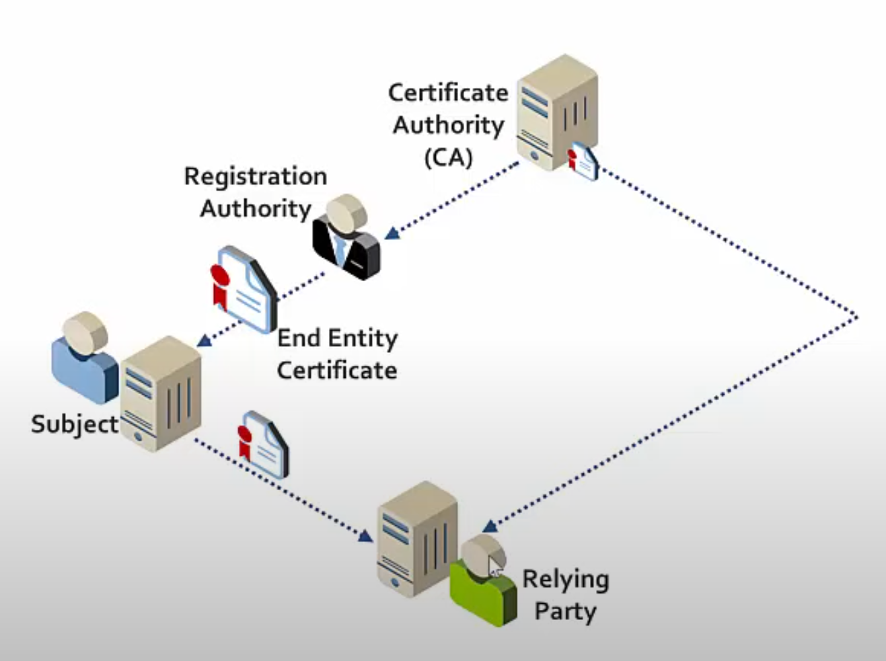
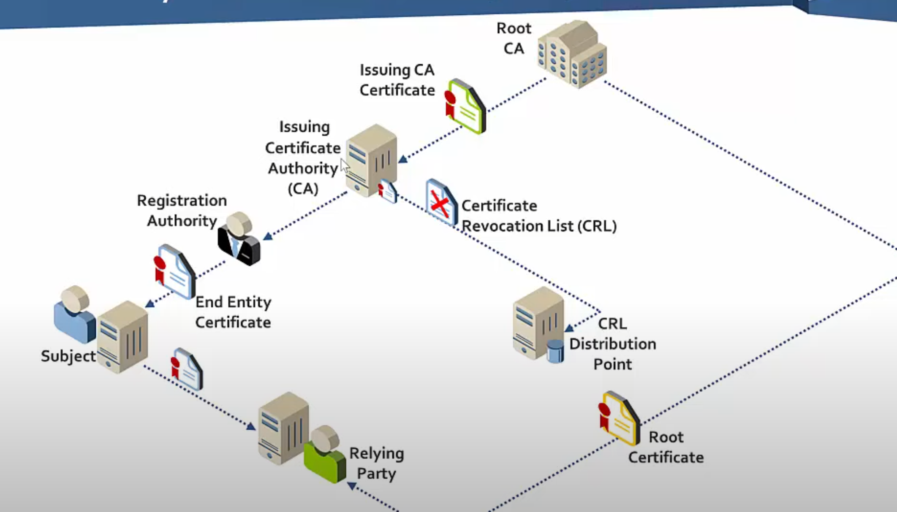

### **Public Key Infrastructure (PKI)**

---

#### **Introduction to PKI**
- **Definition**: Public Key Infrastructure (PKI) is a framework used to secure communication and validate identities through certificates.
- **Components**:
  - **Web Server (Bob)**: Hosts a website, e.g., bob.com.
  - **User (Sally)**: Wants to securely connect to Bob’s website.

---

#### **Scenario: Securing Communication Between Bob and Sally**
1. **Step 1**: Bob requests a certificate for his website from a **Certificate Authority (CA)**.
   - CA verifies Bob’s authority to request a certificate for bob.com.
   - Verification is handled by the **Registration Authority (RA)**:
     - **Role**: Ensures Bob has control over the domain.
     - **Method**: Can be manual or automated.

2. **Step 2**: After approval from the RA, the CA issues a certificate for bob.com.
   - **Terminology**:
     - The web server (bob.com) is the **subject** of the certificate.

3. **Step 3**: Sally connects to bob.com.
   - The server provides its certificate to Sally.
   - Sally, as the **relying party**, uses the certificate to ensure she is connected to the legitimate website and not a rogue site.

---

#### **Authenticity of Certificates**
- **Problem**: Sally needs to verify the authenticity of the certificate she received.
- **Solution**:
  - Sally uses the CA’s **certificate** or **public key** to validate the signature on Bob’s certificate.
  - **Embedded Certificates**:
    - CAs work with software manufacturers (e.g., Microsoft, Google, Mozilla) to embed their **root certificates** into software.

---

#### **Root vs. Issuing Certificate Authorities**
- **Root Certificate Authority (Root CA)**:
  - Issues certificates to **Issuing Certificate Authorities**.
  - Operates offline for enhanced security.
  - Audited to ensure stringent security practices.
  - Provides its root certificate to software manufacturers to embed in their software.

- **Issuing Certificate Authority**:
  - Issues certificates to entities like Bob.
  - Operates online but relies on the Root CA for initial validation.

- **Why Separate Roles?**
  - If an issuing CA is compromised, only its certificates need to be updated, reducing disruption.

---

#### **Certificate Revocation**
- **Problem**: Certificates can become invalid due to:
  - Private key compromise.
  - Rogue activity within an organization.
- **Solution**:
  - **Certificate Revocation List (CRL)**:
    - A list of invalid certificate serial numbers published by the CA.
    - Accessible via a **CRL Distribution Point** (a public site).
  - **Online Certificate Status Protocol (OCSP)**:
    - An alternative to CRLs.
    - Allows users to request the status of specific certificates without downloading the entire CRL.

---

#### **Google’s Certificate Transparency**
- **Purpose**: Improves visibility into issued certificates.
- **Process**:
  - CAs publish issued certificates to public logs.
  - Detects duplicate or rogue certificates easily.
- **Limitations**:
  - Works well for public certificates but may expose sensitive information for private certificates.

---

#### **Additional Components of PKI**
1. **Legal and Policy Framework**:
   - CAs publish:
     - **Certificate Practice Statements**.
     - **Certificate Policies**.
   - Defines the rules and practices for issuing and managing certificates.

2. **Attack Surface in PKI**:
   - Vulnerabilities include:
     - Weak key generation software (e.g., Debian’s 2008 issue).
     - Improper validation of signatures by relying party software.

---

#### **Key Terminology Recap**
- **Certificate Authority (CA)**: Issues and validates certificates.
- **Registration Authority (RA)**: Verifies the requester’s identity and authority.
- **Root Certificate Authority (Root CA)**: Operates offline for security and issues certificates to issuing CAs.
- **Subject**: The entity (e.g., web server) associated with the certificate.
- **Relying Party**: The entity (e.g., Sally) relying on the certificate for secure communication.
- **Certificate Revocation List (CRL)**: A list of revoked certificates.
- **Online Certificate Status Protocol (OCSP)**: A more efficient way to check certificate validity.
- **Certificate Transparency (CT)**: Public logs to detect rogue certificates.

--- 

This breakdown provides a structured view of PKI and its components.