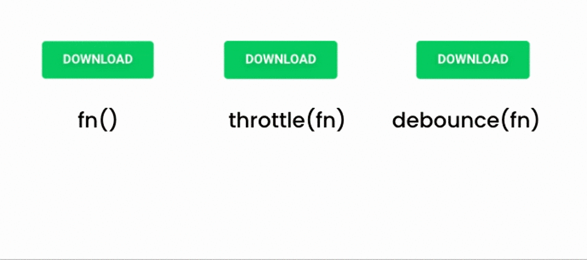

# Senior Frontend Engineer Interview Questions

---

## **Fundamentals**

### **1. What is the *box model* in CSS? Provide an example.**  
**Answer:**  
The box model defines how elements are structured in CSS, consisting of:  
- **Content**: The actual text/image.  
- **Padding**: Space around the content.  
- **Border**: Line around padding.  
- **Margin**: Space outside the border.  
**Example**:  
```css
.box { 
  width: 300px; 
  padding: 20px; 
  border: 5px solid black; 
  margin: 10px; 
}
```  
Total width = 300 + (20*2) + (5*2) + (10*2) = 370px.

---

### **2. Explain the *Virtual DOM* and its purpose.**  
**Answer:**  
The Virtual DOM is an in-memory representation of the real DOM. It allows frameworks like React to batch updates efficiently by comparing the virtual and real DOM (via **diffing**) and applying minimal changes. This reduces expensive reflows/repaints.

---

### **3. What is a *closure* in JavaScript?**  
**Answer:**  
A closure is a function that retains access to its lexical scope even when executed outside that scope.  
**Example**:  
```javascript
function outer() {
  let count = 0;
  return function inner() {
    count++;
    return count;
  };
}
const counter = outer();
counter(); // 1
```

---

### **4. Describe *event delegation*.**  
**Answer:**  
Event delegation leverages event bubbling to handle events at a parent level instead of individual children. Useful for dynamic elements.  
**Example**:  
```javascript
document.getElementById('parent').addEventListener('click', (e) => {
  if (e.target.matches('button')) {
    // Handle button click
  }
});
```

---

### **5. Why can’t React hooks be called conditionally?**  
**Answer:**  
React relies on the **order of hooks** to preserve state between re-renders. Conditional calls disrupt this order, leading to bugs.

---

### **6. What is *CSS specificity*?**  
**Answer:**  
Specificity determines which CSS rule applies when multiple rules conflict. Calculated as:  
- Inline styles (1000) > IDs (100) > Classes (10) > Elements (1).  
**Example**:  
`#nav .item:hover` = 100 + 10 + 10 = 120.

---

### **7. Explain `async` vs `defer` in script loading.**  
**Answer:**  
- **`async`**: Download script asynchronously and execute immediately after download (order not guaranteed).  
- **`defer`**: Download async but execute after DOM parsing (order preserved).

---

### **8. What is the role of HTTP/2 in frontend performance?**  
**Answer:**  
HTTP/2 improves performance via **multiplexing** (parallel streams over one connection), **header compression**, and **server push** (pre-sending assets).

---

## **Practical / Coding**

### **1. Write a React component that toggles text on button click.**  
**Answer**:  
```javascript
import React, { useState } from 'react';

function ToggleButton() {
  const [isVisible, setIsVisible] = useState(true);
  return (
    <div>
      <button onClick={() => setIsVisible(!isVisible)}>
        Toggle
      </button>
      {isVisible && <p>Hello World</p>}
    </div>
  );
}
```

---

### **2. Implement a debounce function.**  

**Answer**:  
```javascript
function debounce(func, delay) {
  let timeoutId;
  return (...args) => {
    clearTimeout(timeoutId);
    timeoutId = setTimeout(() => func.apply(this, args), delay);
  };
}
// Usage: window.addEventListener('resize', debounce(handleResize, 300));
```

---

### **3. Center a div vertically and horizontally using CSS.**  
**Answer**:  
```css
.container {
  display: flex;
  justify-content: center;
  align-items: center;
  height: 100vh;
}
```

---

### **4. Write a function to memoize expensive computations.**  
**Answer**:  
```javascript
const memoize = (fn) => {
  const cache = new Map();
  return (...args) => {
    const key = JSON.stringify(args);
    if (cache.has(key)) return cache.get(key);
    const result = fn(...args);
    cache.set(key, result);
    return result;
  };
};
```

---

### **5. Fix the async state update bug:**  
```javascript
function App() {
  const [count, setCount] = useState(0);
  const increment = () => {
    setTimeout(() => {
      setCount(count + 1);
    }, 1000);
  };
  // Clicking twice increments only once
}
```  
**Answer**: Use the functional update form:  
```javascript
setCount(prev => prev + 1);
```

---

### **6. Predict the output:**  
```javascript
console.log(1);
setTimeout(() => console.log(2), 0);
Promise.resolve().then(() => console.log(3));
console.log(4);
```  
**Answer**: 1, 4, 3, 2.  
**Explanation**: Microtasks (Promises) run before macrotasks (setTimeout).

---

## **System Design / Architecture**

### **1. Design a state management system for a large e-commerce app.**  
**Answer**:  
- Use **Redux**/**Zustand** for global state.  
- Normalize data (e.g., `{ products: { byId: {}, allIds: [] } }`).  
- Middleware for logging/async.  
- Selectors (Reselect) for derived data.  
- Context API for feature-specific state.

---

### **2. How would you optimize a slow-loading dashboard?**  
**Answer**:  
- **Code splitting** (React.lazy).  
- **Lazy load** non-critical components/Images.  
- **Cache** API responses (SWR/React Query).  
- **Bundle analysis** (Webpack Bundle Analyzer).  
- **CDN** for static assets.  
- **SSR** for initial load.

---

### **3. Design a real-time chat feature.**  
**Answer**:  
- **WebSocket** (Socket.io) for bidirectional communication.  
- **Optimistic UI updates** for message sending.  
- **Message queuing** (Redis) for reliability.  
- **Throttling** for typing indicators.  
- **Compression** for messages (Protocol Buffers).

---

## **Edge-Case Scenarios**

### **1. How to handle `JSON.parse` errors?**  
**Answer**:  
```javascript
try {
  const data = JSON.parse(rawString);
} catch (e) {
  console.error('Invalid JSON');
  // Fallback: Set default data
}
```

---

### **2. What happens if a React effect cleanup runs after unmount?**  
**Answer**:  
Modern React handles this safely, but always check mounted state in async operations:  
```javascript
useEffect(() => {
  let isMounted = true;
  fetchData().then(data => {
    if (isMounted) setState(data);
  });
  return () => { isMounted = false };
}, []);
```

---

## **Tricky / Gotchas**

### **1. Why does `this` inside a class method return `undefined`?**  
**Answer**:  
Occurs if the method is called without binding (e.g., as a callback). Fix via:  
- Arrow functions (class field): `handleClick = () => {...}`.  
- Bind in constructor: `this.handleClick = this.handleClick.bind(this)`.

---

### **2. Why does `0.1 + 0.2 !== 0.3`?**  
**Answer**:  
Floating-point precision errors in binary representation. Fix: Use `Number.EPSILON` for tolerance:  
```javascript
Math.abs(0.1 + 0.2 - 0.3) < Number.EPSILON; // true
```

---

## **Deep / Advanced**

### **1. How does browser rendering pipeline work?**  
**Answer**:  
1. **Parse HTML/CSS** → Construct DOM/CSSOM.  
2. **Render Tree** → Combine DOM/CSSOM.  
3. **Layout** (Reflow) → Calculate element positions.  
4. **Paint** → Fill pixels.  
5. **Composite** → Layer management (GPU).

---

### **2. What are the performance implications of CSS `contain`?**  
**Answer**:  
`contain: strict` isolates an element’s rendering, limiting layout/paint scope. Improves performance for complex UIs by reducing reflow/repaint regions.