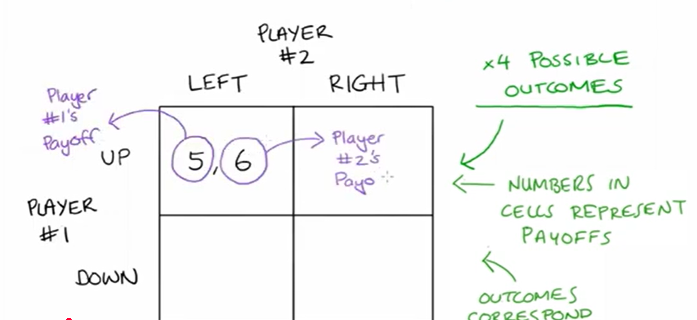

# 🧠 **Nash Equilibrium, Dominant Strategies, and Dominant Strategy Equilibrium**

---

## 🎯 **1. What is a Game in Game Theory?**

- A **game** models strategic interactions between rational decision-makers (called **players**).
- Key assumptions:
  - **Simultaneous play**: Players choose actions without knowing others’ choices.
  - **Complete information**: All players know the rules, possible actions, and payoffs.
  - **Rationality**: Players aim to maximize their own payoff.

> *In this context, we focus exclusively on **pure strategies**—actions chosen with certainty—not probabilistic **mixed strategies**.*

---

## 📊 **2. Representing a Game: The Normal Form (Payoff Matrix)**

- A **2×2 normal-form game** involves:
  - **Two players**: Player 1 (rows), Player 2 (columns).
  - **Two actions per player**: e.g., Player 1: **Up / Down**; Player 2: **Left / Right**.
- Each **cell** contains a **payoff pair**: *(Player 1’s payoff, Player 2’s payoff)*.

### Example Game 1 Payoff Matrix:

|               | **Left**      | **Right**     |
|---------------|---------------|---------------|
| **Up**        | (5, 6)        | (15, 4)       |
| **Down**      | (10, 2)       | **(16, 6)**   |

> 💡 **Convention**: First number = Player 1’s payoff; second = Player 2’s.

---

## 🔍 **3. Best Responses**

A **best response** is a strategy that yields the **highest payoff** for a player, **given the other player’s strategy**.

### 🔹 Finding Player 1’s Best Responses:
- If Player 2 plays **Left**:
  - Up → 5  
  - Down → **10** ✅ → **Best response: Down**
- If Player 2 plays **Right**:
  - Up → 15  
  - Down → **16** ✅ → **Best response: Down**

### 🔹 Finding Player 2’s Best Responses:
- If Player 1 plays **Up**:
  - Left → **6** ✅  
  - Right → 4 → **Best response: Left**
- If Player 1 plays **Down**:
  - Left → 2  
  - Right → **6** ✅ → **Best response: Right**

> 📌 **Visual cue**: Underline the payoff in each cell that corresponds to a best response.

---

## ⚖️ **4. Nash Equilibrium**

### 📘 *Definition*:
> A **Nash Equilibrium (NE)** is a set of strategies where **no player can benefit by unilaterally deviating**—i.e., changing their strategy while others keep theirs fixed.

### 🔎 How to Identify:
- Look for **cells where both payoffs are underlined** → **intersection of best responses**.

In **Game 1**, only **(Down, Right)** has both payoffs underlined → **Nash Equilibrium**.

- Player 1 gets **16** (vs. 15 if switching to Up).
- Player 2 gets **6** (vs. 2 if switching to Left).

✅ **No incentive to deviate** → **Stable outcome**.

> 🧩 **Key Insight**: NE captures **mutual best responses**, not necessarily optimal social outcomes.

---

## 🦸 **5. Dominant Strategies**

### 📘 *Definition*:
> A **dominant strategy** is a strategy that yields a **higher payoff than any other strategy**, **regardless of what opponents do**.

### 🔍 Example: Game 2 Payoff Matrix

|               | **Left**      | **Right**     |
|---------------|---------------|---------------|
| **Up**        | (10, 3)       | (9, 10)       |
| **Down**      | (12, 8)       | **(15, 12)**  |

#### Player 1:
- If Player 2 plays Left: Down (12) > Up (10)
- If Player 2 plays Right: Down (15) > Up (9)  
→ **Down is dominant** for Player 1.

#### Player 2:
- If Player 1 plays Up: Right (10) > Left (3)
- If Player 1 plays Down: Right (12) > Left (8)  
→ **Right is dominant** for Player 2.

✅ Both players have **dominant strategies**.

---

## 🏆 **6. Dominant Strategy Equilibrium (DSE)**

### 📘 *Definition*:
> A **Dominant Strategy Equilibrium** occurs when **all players play their dominant strategies**.

- In **Game 2**, (Down, Right) is a **DSE**.
- Since dominant strategies are always best responses, **every DSE is also a Nash Equilibrium**.
- But **not every NE is a DSE** (e.g., Game 1 has NE but no dominant strategies).

> 🔄 **Hierarchy**:  
> **Dominant Strategy Equilibrium** ⊂ **Nash Equilibrium**

---

## 💻 **7. Algorithmic Identification (Python Example)**

You can programmatically find best responses and Nash equilibria:

```python
import numpy as np

# Payoff matrices: [Player1, Player2]
P1 = np.array([[5, 15],
               [10, 16]])

P2 = np.array([[6, 4],
               [2, 6]])

def find_nash(P1, P2):
    n_rows, n_cols = P1.shape
    nash = []
    for i in range(n_rows):
        for j in range(n_cols):
            # Is (i,j) a best response for P1?
            br1 = P1[i, j] == np.max(P1[:, j])
            # Is (i,j) a best response for P2?
            br2 = P2[i, j] == np.max(P2[i, :])
            if br1 and br2:
                nash.append((i, j))
    return nash

print("Nash Equilibria (row, col indices):", find_nash(P1, P2))
# Output: [(1, 1)] → (Down, Right)
```

> 🛠️ This brute-force method works for small finite games. For larger games, more advanced algorithms (e.g., Lemke-Howson) are used.

---

## 🧮 **8. Strategic Dominance vs. Nash Equilibrium**

| Concept                     | Requires Knowledge of Others’ Strategies? | Always a NE? | Exists in Every Game? |
|----------------------------|------------------------------------------|--------------|------------------------|
| **Dominant Strategy**       | ❌ No                                     | ✅ Yes       | ❌ No                  |
| **Nash Equilibrium**        | ✅ Yes (conditional best response)        | —            | ✅ Yes (in mixed strategies, per Nash’s Theorem) |

> 📜 **Nash’s Existence Theorem**: Every finite game has **at least one Nash equilibrium** in **mixed strategies**.

---

## 🧩 **9. Common Misconceptions**

- ❌ *"Nash Equilibrium means the best outcome for everyone."*  
  → **False!** It’s stable, but may be **Pareto inefficient** (e.g., Prisoner’s Dilemma).
  
- ❌ *"If a player has a dominant strategy, the game always has a DSE."*  
  → **Only if all players have dominant strategies**.

- ❌ *"Multiple Nash equilibria mean the game is unsolvable."*  
  → **Not true**—refinements (e.g., focal points, trembling-hand perfection) help select among them.

---

## 🕹️ **10. Classic Example: Prisoner’s Dilemma**

|                     | **Cooperate** | **Defect**    |
|---------------------|---------------|---------------|
| **Cooperate**       | (−1, −1)      | (−3, 0)       |
| **Defect**          | (0, −3)       | **(−2, −2)**  |

- **Dominant strategy** for both: **Defect**
- **DSE = (Defect, Defect)** → also the **unique NE**
- But **(Cooperate, Cooperate)** gives better joint payoff → illustrates **conflict between individual and collective rationality**

> ⚠️ This is why NE ≠ socially optimal outcome.

---

## 🧠 **11. Extensions & Related Concepts**

- **Mixed Strategy Nash Equilibrium**: Players randomize over actions (e.g., Matching Pennies).
- **Iterated Elimination of Dominated Strategies (IEDS)**: Remove strategies that are never best responses.
- **Pareto Efficiency**: An outcome is Pareto efficient if no player can be made better off without hurting another.
- **Subgame Perfect Equilibrium**: Refinement for dynamic (sequential) games.

### Example: IEDS in Action
If a strategy is **strictly dominated**, it will **never** be played in any NE.

```python
# Strategy "Up" is strictly dominated by "Down" for Player 1 in Game 2
# So we can eliminate "Up" before solving
```

---

## 📈 **12. Real-World Applications**

- **Auctions**: Bidders’ strategies in eBay or spectrum auctions.
- **Oligopoly Pricing**: Firms choosing prices (Bertrand) or quantities (Cournot).
- **Network Security**: Attackers vs. defenders choosing targets/defenses.
- **Blockchain**: Miners deciding whether to follow protocol or fork.

> 🌐 In all these, **strategic interdependence** makes game theory essential.

---

## 🧪 **13. Practice: Identify NE and Dominant Strategies**

### Game A:
|           | L     | R     |
|-----------|-------|-------|
| **U**     | (2,2) | (0,3) |
| **D**     | (3,0) | (1,1) |

- No dominant strategies.
- NE? Check best responses:
  - (U,L): P1→D better → ❌
  - (U,R): P2→L better → ❌
  - (D,L): P2→R better → ❌
  - (D,R): P1→U gives 0 < 1? No. P2→L gives 0 < 1? No. → ✅ **(D,R) is NE**

### Game B:
|           | L     | R     |
|-----------|-------|-------|
| **U**     | (4,1) | (2,0) |
| **D**     | (3,2) | (1,3) |

- Player 1: U > D when L (4>3), U > D when R (2>1) → **U dominant**
- Player 2: R > L when U (0<1? No), R > L when D (3>2) → **No dominant strategy**
- NE: (U,L) → both best responses → ✅

> 🔁 Try coding these in the Python snippet above!

--- 

## 🧭 **14. Strategic Thinking Checklist**

When analyzing a game:

1. ✅ List all players and actions.
2. ✅ Write the payoff matrix clearly.
3. ✅ For each player, find best responses to every opponent action.
4. ✅ Underline best-response payoffs.
5. ✅ Identify cells with **two underlines** → **Nash Equilibria**.
6. ✅ Check if any strategy is **always** a best response → **Dominant Strategy**.
7. ✅ If all players have dominant strategies → **Dominant Strategy Equilibrium**.

> 🎯 Master this flow, and you’ve grasped the core of **non-cooperative game theory**.


# 🎮 **Game Theory Essentials**
> *Pure Strategies • Simultaneous Moves • Full Information*

---


## 🧩 **Game 1: 2×2 Matrix Walkthrough**

|               | **Left** | **Right** |
|---------------|----------|-----------|
| **Up**        | 5 6      | 15 4      |
| **Down**      | 10 2     | 16 6 ⭐    |

### 🔍 **Step-by-Step Best-Response Analysis**

1. **Player 1’s View**  
   - If P2 ➜ *Left*:  
     – Up = 5 vs Down = **10** ➜ *Best = Down*  
   - If P2 ➜ *Right*:  
     – Up = 15 vs Down = **16** ➜ *Best = Down*  

2. **Player 2’s View**  
   - If P1 ➜ *Up*:  
     – Left = **6** vs Right = 4 ➜ *Best = Left*  
   - If P1 ➜ *Down*:  
     – Left = 2 vs Right = **6** ➜ *Best = Right*  

> 🎯 **Nash Equilibrium** = *(Down, Right)* – the only cell with **two underlines**.

---

## 🏆 **Game 2: Dominant Strategy Equilibrium**

|               | **Left** | **Right** |
|---------------|----------|-----------|
| **Up**        | 10 3     | 9 10      |
| **Down** ⭐   | 12 8     | 15 12 ⭐  |

### 🔍 **Best-Response & Dominance**

- **Player 1**  
  - P2 = *Left* ➜ Down (12) > Up (10)  
  - P2 = *Right* ➜ Down (15) > Up (9)  
  ➜ *Down* **strictly dominates** *Up* 🚀  

- **Player 2**  
  - P1 = *Up* ➜ Right (10) > Left (3)  
  - P1 = *Down* ➜ Right (12) > Left (8)  
  ➜ *Right* **strictly dominates** *Left* 🚀  

> 🎯 **Dominant Strategy Equilibrium** = *(Down, Right)*  
> *(also the unique Nash equilibrium)*

---

## 🧠 **Key Concepts Cheat-Sheet**

| Term | Emoji | One-Line Reminder |
|------|-------|-------------------|
| **Best Response** | 🎯 | Highest payoff *given* rival’s action |
| **Nash Equilibrium** | ⚖️ | Mutual best responses—no one regrets *ex post* |
| **Dominant Strategy** | 👑 | Best *regardless* of rival’s action |
| **Dominated Strategy** | 🗑️ | Never best; can be deleted |
| **Pure Strategy** | 📄 | Single action chosen with certainty |
| **Mixed Strategy** | 🎲 | Probability distribution over actions *(not covered here)* |

---

## 🛠️ **Python Snippet: Best-Response Finder**

```python
import numpy as np

# Payoff matrices (P1, P2)
P1 = np.array([[5, 15], [10, 16]])  # rows = Up/Down
P2 = np.array([[6, 4], [2, 6]])     # cols = Left/Right

def best_responses(payoff):
    """Return best-response indices for the row player."""
    return [np.argmax(row) for row in payoff]

br1 = best_responses(P1)  # [1, 1] ➜ Down always
br2 = best_responses(P2.T)  # [0, 1] ➜ Left if Up, Right if Down

# Nash cells have (br1[col] == row) AND (br2[row] == col)
nash = [(r, c) for r in range(2) for c in range(2)
        if br1[c] == r and br2[r] == c]
print("Nash equilibria (row, col):", nash)
# Output: [(1, 1)]
```

---

## 🧪 **Practice Drill**

### Matrix 3 (Your Turn)

|       | **A** | **B** |
|-------|-------|-------|
| **X** | 2 7  | 0 0  |
| **Y** | 3 3  | 1 4  |

1. Find **all** best responses for each player.  
2. Underline payoffs accordingly.  
3. List **every** pure-strategy Nash equilibrium.  
4. Identify any **dominant strategies**.

> ✏️ *Hint: There are two Nash equilibria here.*

---

## 🌟 **Advanced Micro-Notes**

- **Iterated Deletion of Strictly Dominated Strategies**  
  – Remove *Up* for P1 in Game 2; matrix collapses to one row.  
- **Weak vs Strict Dominance**  
  – *Weak*: payoff ≥ everywhere, = somewhere.  
  – *Strict*: payoff > everywhere.  
- **Rationalizability**  
  – Strategies surviving *infinite* iterated deletion; set contains Nash.

---

## 📊 **Real-World Mini-Cases**

1. **Pricing War** 🏷️  
   – Two airlines choosing *High* or *Low* fare.  
   – *Low* often strictly dominates, leading to Bertrand trap.

2. **Penalty Kick** ⚽  
   – Kicker *Left/Right* vs Goalie *Left/Right*.  
   – No pure dominance ➜ requires *mixed* Nash (not covered).

3. **Climate Agreement** 🌍  
   – Countries *Abate* or *Pollute*.  
   – *Pollute* can dominate individually, yielding social dilemma.

---

## 🧩 **Quick Quiz**

❓ **True or False**  
1. A dominant strategy equilibrium is always a Nash equilibrium.  
2. A game can have 0, 1, 2, … or infinitely many Nash equilibria.  
3. If a player has a dominant strategy, every opponent’s best response must be unique.

> Answers: 1️⃣ **T** 2️⃣ **T** 3️⃣ **F**