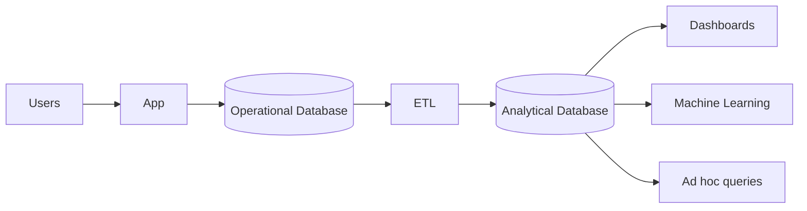

# Operational Systems vs Analytical Systems

## Why This Matters

Most applications need two very different workloads:

* **Serving users in real time**
* **Analyzing large amounts of historical data**

Trying to use one database for both often leads to slow queries, poor scalability, and unhappy users.

That's why modern architectures separate **Operational Systems (OLTP)** from **Analytical Systems (OLAP)**.

---

# Core Idea

Think of them as serving different purposes:

| System                        | Purpose                 |
| ----------------------------- | ----------------------- |
| **Operational System (OLTP)** | Run the business        |
| **Analytical System (OLAP)**  | Understand the business |

Operational systems optimize for:

* Fast reads and writes
* Thousands of concurrent users
* Data consistency

Analytical systems optimize for:

* Large scans
* Aggregations
* Historical reporting
* Business intelligence

---

# How It Works



### Step 1: Users interact with the application

Examples:

* Login
* Create orders
* Update profiles
* Make payments

These operations go to an **OLTP database**.

---

### Step 2: Data is replicated

Data moves from OLTP to OLAP using:

* CDC (Change Data Capture)
* Streaming
* ETL pipelines

Common tools:

* Debezium
* Kafka
* Airbyte
* Fivetran

---

### Step 3: Analytics happen elsewhere

Business teams run:

* Reports
* Dashboards
* Cohort analysis
* Forecasting
* AI and ML workloads

Without affecting production traffic.

---

# Key Components

## Operational System (OLTP)

Characteristics:

* Small transactions
* Row-oriented storage
* ACID guarantees
* Millisecond latency

Typical databases:

* PostgreSQL
* MySQL
* SQL Server
* MongoDB

Example query:

```sql
SELECT *
FROM orders
WHERE id = 1045;
```

Looking up one row should be extremely fast.

---

## Analytical System (OLAP)

Characteristics:

* Large scans
* Columnar storage
* Compression
* Parallel execution

Typical systems:

* Snowflake
* BigQuery
* ClickHouse
* Redshift
* DuckDB

Example query:

```sql
SELECT
    country,
    SUM(total_amount)
FROM orders
WHERE order_date >= '2026-01-01'
GROUP BY country;
```

This query may scan billions of rows.

---

# Example

Imagine an e-commerce platform.

### Operational database

Stores:

* Users
* Orders
* Payments
* Inventory

Requirements:

* Low latency
* Strong consistency

PostgreSQL is a good fit.

---

### Analytical database

Stores:

* Years of order history
* Customer behavior
* Revenue metrics

Requirements:

* Fast aggregations
* Historical analysis

ClickHouse or Snowflake are better choices.

---

# Storage Differences

## OLTP (Row Storage)

```
Row 1:
1 | Alice | US | 100

Row 2:
2 | Bob | UK | 200
```

Optimized for retrieving complete records.

---

## OLAP (Column Storage)

```
IDs:
1,2

Names:
Alice,Bob

Countries:
US,UK

Amounts:
100,200
```

Optimized for scanning only required columns.

---

# Trade-offs

| Pros                   | Cons                                 |
| ---------------------- | ------------------------------------ |
| Fast user transactions | Not ideal for heavy analytics        |
| Strong consistency     | Expensive joins across huge datasets |
| Low latency            | Scaling reads can become difficult   |
| Simple schema design   | Historical reporting is slower       |

| Pros                          | Cons                            |
| ----------------------------- | ------------------------------- |
| Excellent for aggregations    | Higher latency                  |
| Compression saves storage     | Not suited for frequent updates |
| Scales to petabytes           | Eventual consistency is common  |
| Great for BI and AI workloads | More infrastructure             |

---

# Best Practices 

## Keep OLTP and OLAP separate

Avoid running large reporting queries on production databases.

---

## Use CDC instead of batch exports

Modern pipelines prefer:

```
PostgreSQL
    ↓
Debezium
    ↓
Kafka
    ↓
ClickHouse/Snowflake
```

Benefits:

* Near real-time analytics
* Reduced database load
* Better scalability

---

## Use columnar databases for analytics

Popular choices:

### ClickHouse

Best for:

* Real-time analytics
* Event data
* High ingestion rates

### Snowflake

Best for:

* Managed cloud warehouses
* Data sharing
* Enterprise BI

### BigQuery

Best for:

* Serverless analytics
* Google Cloud ecosystems

### DuckDB

Best for:

* Local analytics
* Embedded workloads
* Data science

---

## Adopt the Lakehouse architecture

Modern data stacks increasingly combine:

* Object storage
* Open formats
* Compute engines

Examples:

* Apache Iceberg
* Delta Lake
* Apache Hudi

This provides warehouse-like performance with data lake flexibility.

---

## Stream events instead of copying tables

Prefer:

```
Application
    ↓
Kafka
    ↓
Stream processing
    ↓
Analytics systems
```

Over nightly ETL jobs.

---

# Alternatives

## Single Database

Suitable when:

* Small applications
* Limited reporting
* Few users

Examples:

* PostgreSQL only
* MySQL only

Simple, but doesn't scale well.

---

## HTAP Systems

Hybrid Transactional/Analytical Processing combines both workloads.

Examples:

* TiDB
* SingleStore
* AlloyDB

Useful when near real-time analytics are required.

Trade-off:

Complexity and higher cost.

---

# Key Takeaways

* **OLTP systems run the business; OLAP systems explain the business.**
* **Operational databases optimize for transactions and low latency.**
* **Analytical databases optimize for large scans and aggregations.**
* **Columnar storage is the foundation of modern analytics engines.**
* **CDC and streaming pipelines are replacing batch ETL.**
* **Separating OLTP and OLAP improves scalability and reliability.**
* **Lakehouse architectures and HTAP databases are shaping modern data platforms.**
