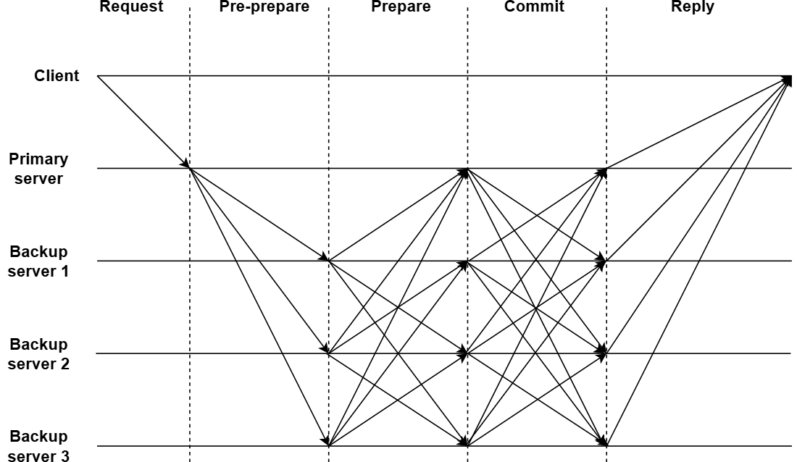

### Types of Byzantine failures

Types of Byzantine failures can be divided into the following two categories:

1.  **Fail-stop failure:** Node permanently stops working and does not return any result.

2.  **Arbitrary node failure:** Node does not stop permanently and shows one of the following behaviors:

  a. It does not return a result.

  b. It returns an incorrect result.

  c. It deliberately returns a misleading result.

  d. It returns different results to different parts of the system.

### How does pBFT work?

The pBFT algorithm provides practical state machine replication in which all nodes are sequentially ordered, with one node as the primary node and others as secondary nodes (backup/replica nodes). A pBFT can function on the condition that the total number of malicious nodes must be less than one-third of the total nodes nn in the system.

The pBFT consensus happens in the following five steps:

1.  The client makes a request and sends it to the primary node.

2.  The primary node broadcasts the request to all the secondary(backup) nodes. It is called the pre-prepare phase.

3.  Then every node (primary and secondary) sends a prepare message to all other nodes.

4.  Once every node receives (n/3)+1(n/3)+1prepare messages, it sends a commit message to all other nodes and commits the changes made by the client's request.

5.  Once every node receives (n/3)+1(n/3)+1 commit messages from other nodes, it sends a reply to the client.

The primary node is changed during every consensus round, and all nodes vote to elect a new primary node. It is also known as the view change protocol.

### Advantages of pBFT

The following are a few advantages of using pBFT over other consensus algorithms:

1.  **Energy efficient:** pBFT does not need to compute complex mathematical problems to reach a consensus. Therefore, it is much faster and energy efficient than algorithms such as proof of work.

2.  **Faster transaction finality:** Consensus algorithms such as proof of work require confirmations from other nodes before adding it to their journal (which takes 10--60 minutes). However, pBFT does not require any confirmations, it is much more efficient than other consensus algorithms.

3.  **Low reward variance:** In pBFT, every node is participating in processing the client's request. Hence, every node can be incentivized, resulting in low reward variance and a more fair reward system.

### Limitations of pBFT

Some limitations of pBFT are as follows:

1.  **Sybil attacks:** A distributed network using pBFT is susceptible to [Sybil attacks](https://how.dev/answers/what-is-a-sybil-attack-in-blockchain) if one entity controls many nodes in the network. As the number of nodes increases, it becomes difficult to carry out a Sybil attack.

2.  **Scalability:** As the number of nodes in the network increases, communication overhead (messages sent to other nodes) increases. It is shown by the equation,O(nk)O(nk), where nn is the messages and kk is the number of nodes.